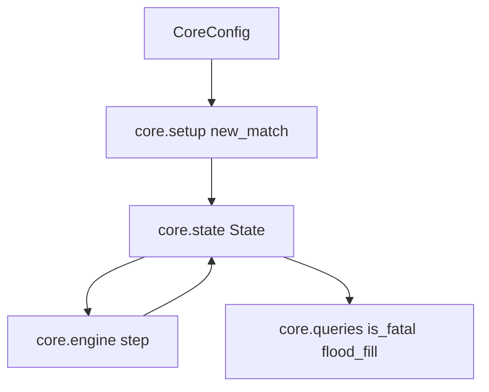

# U1 Core — Functional Design Plan

**Unit**: `u1-core`  
**Scope**: `core.state`, `core.setup`, `core.engine`, `core.queries`  
**Out of this unit**: `core.features` (U2), agents, MatchService, UI, TreeAgent payload (U5/U7)

## Execution checkboxes

- [x] Analyze unit context (`unit-of-work.md`, story-map, D01–D30)
- [x] Register D30 and close Inception
- [x] Draft locked algorithm outline (below)
- [x] Collect answers in this file (`[Answer]:` tags)
- [x] Resolve ambiguities (clarification file only if needed) — none; Q1/Q3 X were specific; registered D31
- [x] Write `aidlc-docs/construction/u1-core/functional-design/domain-entities.md`
- [x] Write `aidlc-docs/construction/u1-core/functional-design/business-rules.md`
- [x] Write `aidlc-docs/construction/u1-core/functional-design/business-logic-model.md`
- [x] Document **Propriedades Testáveis** (PBT-01) in those artifacts
- [x] Present two-option Functional Design completion (next: U1 NFR Requirements)

No application code in this stage.

## Locked (do not re-ask)

| Topic | Source |
| --- | --- |
| Board 20x20; origin `(0,0)` top-left; `x` right, `y` down | requirements |
| Spawns NW/SE, length 3, facing center | D25 |
| Initial food scan from `(10,9)` | D26 |
| Obstacles: even count, Chebyshev r=2 zones, 180° symmetry, all free cells 4-connected, retry `seed + k*1000003`, fail after 100 | D26/D29 |
| `is_fatal`: deterministic only; own tail by real eat; opponent tail solid iff opponent head 4-adjacent to food | D24/D29 |
| Rules 1–10 including swap-heads, simultaneous death draw, tail vacate unless ate | D14 |
| Match length 1800 ticks; `tick_rate` is display-only | D07 |
| `setup` builds the match; `engine.step` is tick rules only; no clock, no Pygame | D28 |
| `flood_fill(state, start, limit=200)` | D28 |
| U1 accept: rules 1–10, 1000 random matches, coverage `core/` ≥ 80%, PBT `is_fatal`, PBT `setup` | D30 |
| DoD: ruff, pytest, public type hints, `decisions.md`, commit + tag `u1-done` | D30 |

## Module flow



Text alternative:

```
CoreConfig -> setup.new_match -> State
State -> engine.step -> State
State -> queries.is_fatal / queries.flood_fill
```

```
+---------------------------+
| U1 Core                   |
| setup -> state            |
| state -> engine           |
| state -> queries          |
+---------------------------+
```

## Planned algorithms (subject to answers below)

### setup.new_match

1. Place NW and SE snakes (D25). Assign sides from the `sides` argument (U3/U7 pass tournament parity; default human NW / machine SE).
2. Place initial food with the D26 cyclic scan from `(10, 9)`.
3. If `obstacle_count == 0`, empty obstacle set.
4. Else generate pairs with 180° symmetry, skip forbidden Chebyshev zones, require one 4-connected component of all free cells (in-bounds, not obstacle, not initial bodies). Retry with `seed_k`. After 100 failures raise an explicit setup error.

### engine.step

1. If already terminal, return the same logical snapshot (no tick increment).
2. Map each relative action to an absolute delta from current facing; reverse is not representable.
3. Compute next heads simultaneously.
4. Decide who would eat (`next_head == food`).
5. Build occupancy: bodies except tails that vacate this tick (vacate only if that snake does not eat).
6. Deaths: wall, obstacle, occupied body cell, head-on-head / swap (rule 4), both dead => draw (rule 8).
7. Grow / pop tails; respawn food if a survivor ate.
8. Increment tick; at 1800 stop; `outcome` uses D14b (timeout by length).

### queries.is_fatal

Oracle for mask/expert: wall, obstacle, bodies with D29 tail convention. Does **not** treat possible head-to-head as fatal.

### queries.flood_fill

4-connected walk from `start`, cap `limit=200`. Blocked: out of board, obstacles, current bodies. Food is walkable.

## PBT properties to document after answers (PBT-01)

| Property | Category | Rule |
| --- | --- | --- |
| `copy` then field-wise equality | Round-trip | PBT-02 |
| `is_fatal` False => simulated tick does not kill that snake by a deterministic cause | Oracle / invariant | PBT-03, D28/D30 |
| `setup`: 180° symmetry; all free cells one component; forbidden zones empty; same seed => same State | Invariant | PBT-03, D30 |
| Engine: exactly one food; lengths >= 3 while alive; at most one winner or a draw; obstacles remain solid | Invariant | PBT-03 |
| Domain generators for legal boards, snakes, seeds | Generators | PBT-07 |
| Tests live next to `tests/core/` | Placement | PBT-08 |
| Failures shrink to a minimal example | Shrink | PBT-09 |

PBT-01, PBT-04, PBT-05, PBT-06 remain advisory (partial mode).

## Questions

Answer each item by writing the letter after `[Answer]:` in this file. Use `X` and describe if none of the options fit. Reply in chat when finished (`pronto` / `done`).

## Question 1

After a snake eats, how does mid-match food respawn choose the next free cell?

A) Same cyclic scan as kickoff: start at `(10, 9)`, walk `y` then `x`, wrap once; first cell that is in-bounds, not a body, not an obstacle (deterministic; no extra RNG)

B) Uniform pick among free cells using the match `seed` plus tick (RNG; still reproducible)

C) Resume the D26 scan from the cell **after** the food that was just eaten, then wrap

X) Other (please describe after [Answer]: tag below)

[Answer]:  X — Sorteio uniforme entre as células livres (opção B), com o RNG derivado de forma pura: numpy.random.default_rng(SeedSequence([match_seed, tick])). Não usar hash() do Python. Stream separado do usado na geração de obstáculos.

## Question 2

Both heads land on the food cell in the same tick (this is also head-to-head). What happens?

A) Resolve head-to-head first (rule 4). If one snake survives, that survivor eats and grows; if both die, food stays

B) Both eat (both grow) **then** apply head-to-head on the new lengths

C) Neither eats; apply head-to-head only; food stays

X) Other (please describe after [Answer]: tag below)

[Answer]: A

## Question 3

How does `engine.step` treat `State`, and does U1 store a death cause for later reports?

A) Pure function: returns a **new** `State`; input unchanged. `State` stores `death_cause` per snake (`wall`, `obstacle`, `self_body`, `opponent_body`, `head_to_head`, `timeout`). `is_terminal` / `outcome` stay separate queries

B) Mutates the input `State` in place and returns it. Same `death_cause` fields as A

C) Pure new `State` **without** `death_cause`; U7 infers cause later from positions

X) Other (please describe after [Answer]: tag below)

[Answer]:  X — Opção A, com um ajuste: death_cause por cobra ∈ {wall, obstacle, self_body, opponent_body, head_to_head}; o fim por tempo vai num campo separado end_reason ∈ {death, timeout} no State, porque timeout não é causa de morte. Numa morte simultânea, registrar a causa de cada cobra.

## Question 4

What is the PBT oracle when `is_fatal(state, snake_id, action)` is False?

A) Run `engine.step` with that action and opponent `straight`. The tested snake must not die from wall, obstacle, or body (head-to-head deaths do not count as a violation)

B) Check occupancy math only (no `step`); the oracle is the same rules as `is_fatal` itself

C) Run `step` against **all three** opponent actions; none of those ticks may kill the tested snake by wall, obstacle, or body

X) Other (please describe after [Answer]: tag below)

[Answer]: c

## Question 5

How should U1 meet “1000 random matches” and “coverage ≥ 80% in `core/`” before `core.features` exists?

A) Test helper (not `RandomAgent`): each snake samples uniformly from `{straight, turn_left, turn_right}` via a generator seeded from the match seed. Coverage ≥ 80% of `core/{state,setup,engine,queries}` at U1; after U2 the same ≥ 80% applies to all of `core/` including `features.py`

B) Defer the 1000-match run to U3 (`RandomAgent`). U1 only example-based rule tests + PBT. Coverage ≥ 80% of the U1 modules only, kept ≥ 80% on whole `core/` after U2

C) Same helper as A for the 1000 matches, but coverage is measured on whatever files exist under `core/` at each unit (U1 must already be ≥ 80%; U2 must not drop below 80%)

X) Other (please describe after [Answer]: tag below)

[Answer]: A
