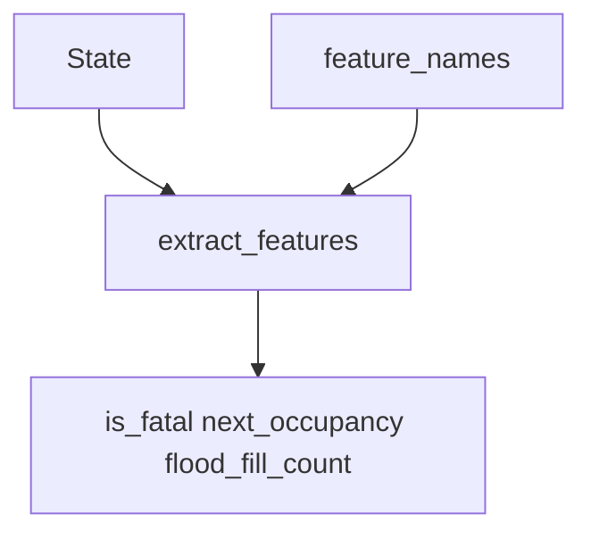

# U2 Features — Functional Design Plan

**Unit**: `u2-features`  
**Scope**: `core.features` (`extract_features`, `feature_names`)  
**Depends on**: U1 `State`, `is_fatal`, `next_occupancy` (conservative), `flood_fill_count` / `reachable_cells`  
**Out of this unit**: agents, MatchService, UI labels (U7), tree/sklearn, safety_mask

## Execution checkboxes

- [x] Analyze unit context (`unit-of-work.md`, story-map, D19/D25/D33/D36/D37, U1 queries)
- [x] Collect answers in this file (`[Answer]:` tags)
- [x] Resolve ambiguities — Q2/Q5/Q8 X/notes were specific; registered D38
- [x] Write `aidlc-docs/construction/u2-features/functional-design/domain-entities.md`
- [x] Write `aidlc-docs/construction/u2-features/functional-design/business-rules.md`
- [x] Write `aidlc-docs/construction/u2-features/functional-design/business-logic-model.md`
- [x] Document **Propriedades Testáveis** (PBT-01) including D19/D38 rotation/mirror
- [x] Present two-option Functional Design completion (next: U2 NFR Requirements)

No application code in this stage.

## Locked (do not re-ask)

| Topic | Source |
| --- | --- |
| Single function `extract_features(state, snake_id)` for train and play | PRD / RF |
| Exactly **20** features; English identifiers; PT labels are U7 | D18 |
| Obstacles count as danger and block flood fill | D23 |
| `space_free_*` = flood after the move / `min(200, free_cells)`, saturate `[0, 1]` | D25 |
| Features / expert / mask omit `opponent_action` (conservative occupancy) | D33 |
| PBT: rotation 90/180/270 → **same** vector; mirror (forward axis) swaps left ↔ right | D19 |
| Determinism: same `(state, snake_id)` → same vector | requirements |
| Binary ∈ {0, 1}; distances and `space_free_*` ∈ [0, 1]; `length_diff` integer | requirements |
| Coverage omit of `features.py` is removed in **U2 Code Generation** | U2 CG seed |
| Python ≥ 3.13 | D37 |
| Example tests may `_place` via `replace` on `new_match`; PBT does not invent arbitrary boards | D36 spirit |

## English names (locked order to confirm in Q8)

PRD Portuguese → code name. Order below is the intended sklearn column order unless Q8 says otherwise.

| # | Code name | PRD |
| --- | --- | --- |
| 0–2 | `danger_ahead`, `danger_left`, `danger_right` | `perigo_*` |
| 3–5 | `dist_danger_ahead`, `dist_danger_left`, `dist_danger_right` | `dist_perigo_*` |
| 6–8 | `space_free_ahead`, `space_free_left`, `space_free_right` | `espaco_livre_*` |
| 9–12 | `food_ahead`, `food_left`, `food_right`, `food_behind` | `comida_*` |
| 13 | `dist_food` | `dist_comida` |
| 14 | `opponent_closer_to_food` | `oponente_mais_perto_comida` |
| 15 | `dist_opponent_head` | `dist_cabeca_oponente` |
| 16–18 | `head_risk_ahead`, `head_risk_left`, `head_risk_right` | `risco_cabeca_*` |
| 19 | `length_diff` | `diff_tamanho` |

## Module flow



Text alternative:

```
State + snake_id -> extract_features -> FeatureVector
extract_features -> is_fatal / next_occupancy / flood_fill_count
feature_names -> fixed English list
```

```
+-----------------------------+
| U2 Features                 |
| extract_features            |
| uses queries and State      |
+-----------------------------+
```

## Planned algorithms (subject to answers below)

### extract_features

1. Read `me = state.snake(id)`, `opp = state.opponent(id)`, facing = `me.direction`.
2. For each relative action `{straight, turn_left, turn_right}` map to ahead/left/right.
3. Fill the 20 slots per answers (danger, rays, space_free, food half-planes, distances, head risk, length_diff).
4. Return an immutable vector in `feature_names()` order. No I/O, no clock, no sklearn.

### PBT (D19)

- Build states by `new_match` + `step` (Hypothesis draws seed, obstacles, actions).
- Apply a **geometric transform** (rotate or mirror) to that State via `replace` of cells/directions — not a hand-invented board.
- Rotation: vector identical. Mirror on the axis ahead of the head: left ↔ right pair slots swap; non-lateral slots unchanged.

## Questions

Answer each item by writing the letter after `[Answer]:` in this file. Use `X` and describe if none of the options fit. Reply in chat when finished (`pronto` / `done`).

## Question 1

What makes `danger_ahead` / `danger_left` / `danger_right` equal to 1?

A) `is_fatal(state, snake_id, corresponding_action)` is True (wall, obstacle, conservative occupancy — opponent head FATAL, D29 tails)

B) The adjacent cell in that relative direction is out of board, an obstacle, or in the **current** bodies (ignore tail vacate / D29)

C) The adjacent cell is in `next_occupancy(state, id, action)` (conservative) or out of board / obstacle — same cells as A, without calling `is_fatal` by name

X) Other (please describe after [Answer]: tag below)

[Answer]:A

## Question 2

How is `dist_danger_*` measured and normalized?

A) Cast a ray along that relative direction from the cell **ahead of the head** (the first step). Count empty steps until the first blocked cell (OOB / obstacle / current body). `value = steps / max(width, height)`, clipped to `[0, 1]`. If the first step is already blocked, `0`

B) Same ray as A, but start counting from the **head cell**; first step blocked → `0`; divisor `max(width, height) - 1`

C) Manhattan distance to the nearest blocked cell anywhere in that half-plane, divided by `width + height - 2`

X) Other (please describe after [Answer]: tag below)

[Answer]:X — Raio como na opção A (começa na célula de destino, conta passos livres até o primeiro bloqueio, divide por max(width, height), clip [0, 1]), mas o conjunto de células bloqueadas é o MESMO de is_fatal: fora do tabuleiro, obstáculos e next_occupancy(state, id, action_da_direção) conservador. Não usar corpos atuais.

## Question 3

How is `space_free_ahead` (and left/right) computed?

A) If `is_fatal` for that action: `0`. Else `flood_fill_count(state, landing_cell, occupancy=next_occupancy conservative, limit=200) / min(200, free_cells)`, clip `[0, 1]`

B) Always `flood_fill_count` from the landing cell with conservative occupancy (blocked start → 0, which covers fatal landings) / `min(200, free_cells)`, clip `[0, 1]`

C) Flood from the **current head**, treating the chosen adjacent cell as the first step, using **current** bodies as occupancy (no `next_occupancy`)

X) Other (please describe after [Answer]: tag below)

[Answer]:A

## Question 4

What is `free_cells` in the D25 denominator (same number for all three `space_free_*`)?

A) Count of in-bounds cells that are not **current** bodies and not obstacles (food counts as free)

B) Same as A but using conservative `next_occupancy` of `straight` as the body mask

C) `width * height - len(obstacles)` only (bodies do not reduce the denominator)

X) Other (please describe after [Answer]: tag below)

[Answer]:A

## Question 5

Food half-planes `food_ahead/left/right/behind` when food is `None`, on the head, or on an axis (same row or column in head coordinates)?

A) `food is None` or food on the head → all four `0`. Otherwise **exclusive** cardinal: compare `(dx, dy)` in the head frame; the dominant axis wins; a pure axis (other component 0) sets only that one bit

B) Inclusive semi-planes: `ahead = (forward_component > 0)`, etc.; a cell on the forward axis can be ahead only; a diagonal can set **two** bits (ahead and left)

C) Four exclusive quadrants using 45° cones in the head frame

X) Other (please describe after [Answer]: tag below)

[Answer]:B — food None ou comida na cabeça → os quatro bits = 0.

## Question 6

`opponent_closer_to_food` and the two Manhattan distances (`dist_food`, `dist_opponent_head`): formula and ties?

A) Distances = Manhattan / `(width + height - 2)`, clip `[0, 1]`. `food is None` → `dist_food = 1`, `opponent_closer = 0`. Closer = opponent Manhattan **strictly less** than mine (tie → 0)

B) Same divisor `max(width, height)`. Closer includes ties (`<=`)

C) Distances = Manhattan / `(width + height)`. Closer uses A* path length, not Manhattan

X) Other (please describe after [Answer]: tag below)

[Answer]:A

## Question 7

When is `head_risk_*` = 1 for a relative action?

A) The landing cell of that action is **4-adjacent to the opponent's current head** (they can step onto it this tick) or **equals** the opponent's current head

B) The landing cell equals any of the opponent's **three** possible next heads (straight / left / right), including out-of-board discarded

C) Only if the landing cell equals the opponent's **current** head (ram without needing their action)

X) Other (please describe after [Answer]: tag below)

[Answer]:B

## Question 8

What is the `FeatureVector` type and column order?

A) Immutable `tuple` of 20 numbers in the table order above; `feature_names()` returns that English list; sklearn callers wrap with `numpy.asarray`

B) `numpy.ndarray` dtype `float64` shape `(20,)` in that order; `length_diff` stored as float

C) Frozen dataclass with named fields plus `as_tuple()` / `as_array()` in that order

X) Other (please describe after [Answer]: tag below)

[Answer]:A — e adicionar a constante FEATURE_SCHEMA_VERSION (ver D38).

## Question 9

What should `extract_features` do if the requested snake is **dead** or the match is already terminal?

A) Still return a full vector from the frozen bodies/food (no exception)

B) Raise `ValueError`

C) Return a zero vector of length 20

X) Other (please describe after [Answer]: tag below)

[Answer]:B
