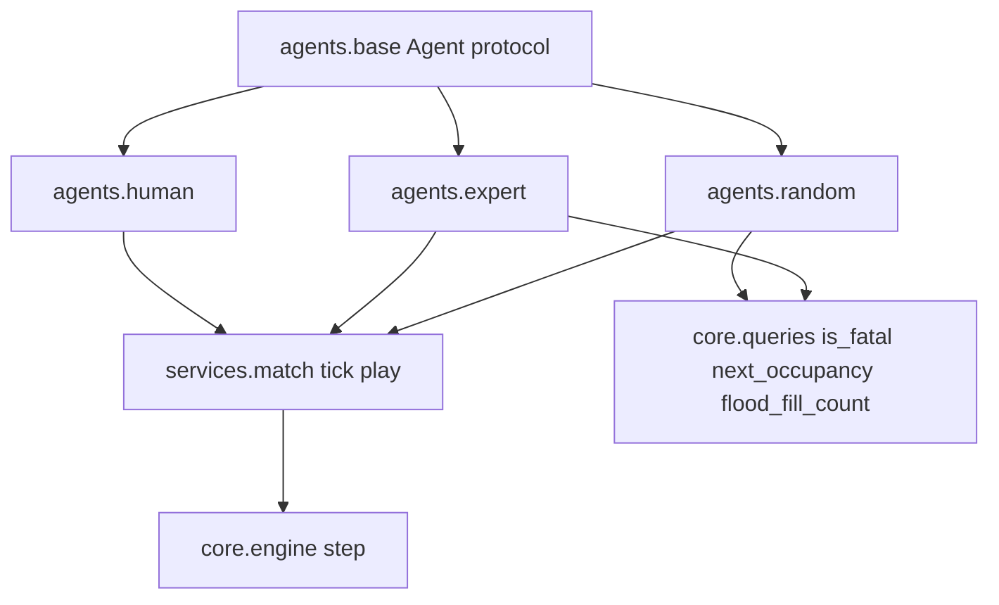

# U3 Agents + MatchService — Functional Design Plan

**Unit**: `u3-agents`
**Scope**: `agents.base`, `agents.random`, `agents.expert`, `agents.human`, `services.match`
**Depends on**: U1 (`State`, `setup.new_match`, `engine.step`, `is_fatal`, `next_occupancy`, `flood_fill_count`), U2 (`extract_features` — not required by U3 itself)
**Out of this unit**: `agents.tree` and `safety_mask` (U5), Pygame and key handling (U4), tournaments / stress reports (U7), training data collection (U5)

## Execution checkboxes

- [x] Analyze unit context (`unit-of-work.md`, story-map, `components.md`, `component-methods.md`, D13/D14/D17/D23/D28/D29/D32/D33)
- [x] Collect answers in this file (`[Answer]:` tags)
- [x] Resolve ambiguities — Q3/Q4/Q6/Q7 X answers were fully specified by the user; registered as D44
- [x] Write `aidlc-docs/construction/u3-agents/functional-design/domain-entities.md`
- [x] Write `aidlc-docs/construction/u3-agents/functional-design/business-rules.md`
- [x] Write `aidlc-docs/construction/u3-agents/functional-design/business-logic-model.md`
- [x] Document **Propriedades Testáveis** (PBT-01) for agents and `tick` — 19 properties
- [x] Present two-option Functional Design completion (next: U3 NFR Requirements)
- [x] Apply the D45 review: `ExplainingAgent.decide` → `ActResult` routed by `tick` / `on_tick`; full buffer ignores the new key; sync `components.md` and `component-methods.md`

No application code in this stage.

## Locked (do not re-ask)

| Topic | Source |
| --- | --- |
| `MatchService` belongs to U3, not U4 | D28 |
| `tick` = two `act` + `engine.step`; no clock, no sleep; caller owns the pace | D28 / components |
| `HumanAgent`: absolute keys, FIFO buffer of at most **2**, consumes **1** per tick, empty → `straight` | RF01 / D28 |
| Reverse (marcha à ré) is ignored | D13 / RF01 |
| Expert = A* to the food, blocked by bodies, internal obstacles and possible next heads; accepts a step only if flood fill > length; otherwise maximum free space | PRD / requirements |
| Expert, features and mask call occupancy **without** `opponent_action` (conservative, D29) | D33 |
| Obstacles are solid for the expert's A* and flood fill | D23 |
| Win rate scoring: win = 1, draw = 0.5, loss = 0; draw rate reported separately | D14b / requirements |
| U3 acceptance: expert ≥ 95% vs random over 500 matches; RNF03 ≥ 1000 matches/min random vs. random; throughput vs. expert recorded without a floor | D17 / unit-of-work |
| Side assignment: human/left agent NW, machine SE; tournaments alternate sides by match index parity | requirements |
| Determinism: no Python `hash()`; RNG through `numpy.random.SeedSequence` | D31 |
| Python ≥ 3.13; ruff + mypy strict on `core/`; PBT profiles `dev` / `full` | D37 / U1 |
| No commits or tags unless explicitly requested | user standing rule |

## Module flow

Text alternative: `agents.base` defines the `act` contract implemented by `random`, `expert` and `human`. `services.match` consumes two agents and calls `core.engine.step`. Only the expert (and possibly the random agent) reads `core.queries`.

---

# Questions

## Question 1
How does an agent know which snake it controls, given that `act(state) -> Action` has no id parameter and tournament sides alternate between matches?

A) Bound at construction — `RandomAgent(SnakeId.A, ...)`; the tournament builds fresh agents per match when sides swap

B) The protocol becomes `act(state, snake_id) -> Action`; agents stay stateless about side and `MatchService` passes the id every tick

C) Bound at construction but re-bindable — `MatchService` calls `agent.bind(snake_id)` once before each match

X) Other (please describe after [Answer]: tag below)

[Answer]: B

## Question 2
What is the `RandomAgent` policy?

A) Uniform over the three relative actions, with no safety awareness — a pure baseline

B) Uniform over the non-fatal actions (`is_fatal` filter), falling back to uniform over all three when every action is fatal

X) Other (please describe after [Answer]: tag below)

[Answer]: B

## Question 3
How is `RandomAgent` seeded, so that a match is reproducible?

A) Own stream per match and side: `SeedSequence([match_seed, 3_000_003, side_index])`, one `Generator` created at construction

B) `Generator` injected by the caller (`RandomAgent(snake_id, rng)`); the seeding policy belongs to `MatchService` and the tests

C) Fresh stream per tick: `SeedSequence([match_seed, tick, side_index])`, which makes the agent a pure function of the state

X) Other (please describe after [Answer]: tag below)

[Answer]:  X — Stream por tick, como na C, mas com uma tag própria para não colidir com o stream da comida: SeedSequence([match_seed, 3_000_003, tick, snake_index]). O agente vira uma função pura do estado.

## Question 4
Which cells does the expert's A* treat as blocked?

A) Conservative `next_occupancy` (no `opponent_action`, D29) ∪ obstacles ∪ the opponent's three in-bounds possible next heads — for every step of the path

B) The same set for the **first** step only; deeper path steps block bodies and obstacles, since the opponent's heads are unknowable that far ahead

C) Bodies ∪ obstacles only; possible next heads are handled later by the `is_fatal` veto and the space test

X) Other (please describe after [Answer]: tag below)

[Answer]: X — Especialista reformulado (ver D44): as possíveis próximas cabeças do oponente só contam no PRIMEIRO passo, e só quando o especialista não for estritamente maior. Nos passos seguintes, bloqueiam apenas a ocupação conservadora e os obstáculos.

## Question 5
The rule "accepts the step only if flood fill > length" — which exact comparison?

A) `flood_fill_count(landing, occupancy=conservative, limit=200) > len(me.body)`

B) `flood_fill_count(...) >= len(me.body) + 1` — room for the whole body plus the new head

C) `> len(me.body)` but with `limit = width * height`, so the 200 cap never distorts the comparison on a nearly empty board

X) Other (please describe after [Answer]: tag below)

[Answer]: A

## Question 6
What is the expert's decision order, including the fallbacks (no A* path, every action fatal)? The order must be total so the agent is deterministic.

A) (1) discard fatal actions; (2) if an A* path exists and its first step passes the space test, take it; (3) otherwise the non-fatal action with the largest flood count; (4) ties broken `straight` > `turn_left` > `turn_right`; (5) if every action is fatal, the same fixed order over all three

B) Same as A, but ties broken first by largest flood, then by smallest Manhattan distance to the food, then by the fixed order

C) Same as A, except that when every action is fatal the expert picks the largest flood anyway (delay death rather than a fixed order)

X) Other (please describe after [Answer]: tag below)

[Answer]: X — Ordem de decisão da D44 (abaixo).

## Question 7
How does `HumanAgent` handle a buffered command that would reverse the current direction?

A) Filtered at `act` time — the consumed command is discarded and that tick returns `straight` (exactly one command leaves the buffer per tick)

B) Filtered at `push_absolute` time — a reverse never enters the buffer, so `act` always consumes a usable command

C) Filtered at `act` time, and after discarding it the agent immediately consumes the next buffered command in the same tick

X) Other (please describe after [Answer]: tag below)

[Answer]: X — Filtrar no push_absolute, comparando com a direção EFETIVA (a do último comando no buffer ou, se vazio, a atual). Descartar também comandos iguais à direção efetiva.

## Question 8
What does `MatchResult` carry?

A) Minimal: winner (A / B / draw), `end_reason`, tick count, final lengths, `death_cause` per snake, seed, and the 1 / 0.5 / 0 score for A

B) A, plus the full trajectory (states and both actions per tick) always recorded

C) A, plus an optional `on_tick` callback so U5 can collect trajectories without `MatchService` ever storing them

X) Other (please describe after [Answer]: tag below)

[Answer]: C

## Question 9
Where does the side-alternation rule (even match index → agent A at NW; odd → swapped) live?

A) `play(agent_a, agent_b, config, seed, sides)` — the caller (U7 / evaluation) computes the parity and passes the assignment

B) `play(..., match_index)` — `MatchService` applies the parity rule itself

C) Outside U3 entirely — `play` always uses the `new_match` defaults and the caller swaps the agents it passes in

X) Other (please describe after [Answer]: tag below)

[Answer]: A

## Question 10
How are the two U3 acceptance numbers enforced — expert ≥ 95% vs random over 500 matches, and RNF03 ≥ 1000 matches/min random vs. random? (Note: 500 full matches is far too slow for the normal pytest run.)

A) Both as on-demand scripts recorded in `aidlc-docs/construction/u3-agents/benchmark.md`; pytest keeps fast reduced versions and the full runs are marked `slow`

B) Both as blocking pytest tests at full N, accepted as a slow suite

C) Throughput informative with **ALERTA** like D40; the 95% win rate blocking in pytest at reduced N (e.g. 100 matches) with the full 500-match run recorded in the benchmark file

X) Other (please describe after [Answer]: tag below)

[Answer]: A

## Question 11
Module layout and shape of `MatchService`?

A) `agents/{base,random_agent,expert,human}.py` + `services/match.py`, with `tick` and `play` as module-level functions

B) The same files, but `MatchService` as a class holding config and the two agents

C) As in A but the file is `agents/random.py` (shadows the stdlib name inside the package; harmless under absolute imports)

X) Other (please describe after [Answer]: tag below)

[Answer]: A

## Question 12
How is the `Agent` contract expressed?

A) `typing.Protocol` — structural, no inheritance required, easy to fake in tests

B) `abc.ABC` with an abstract `act`, so every agent inherits explicitly

X) Other (please describe after [Answer]: tag below)

[Answer]: A
