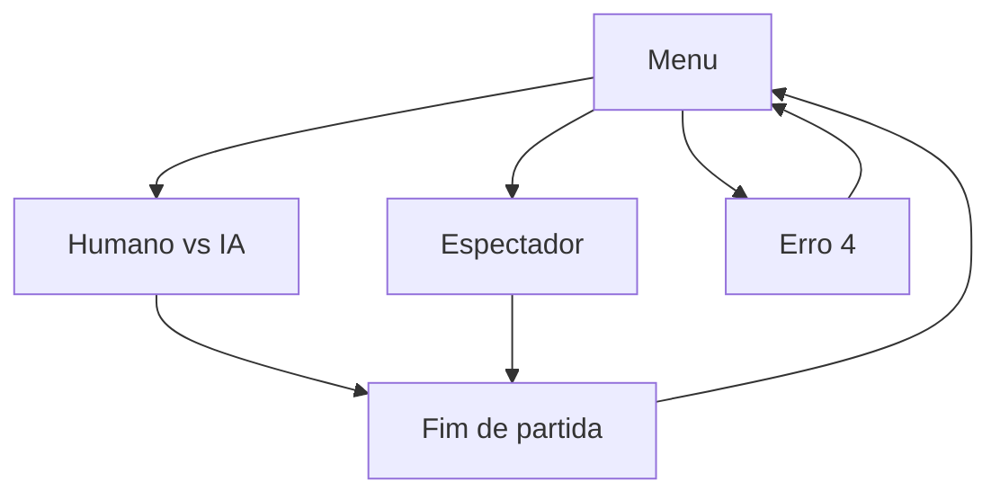

# U4 UI — Functional Design Plan

**Unit**: `u4-ui`
**Scope**: Pygame — menu, HUD, partida humano vs. máquina, espectador IA vs. IA, ritmo `tick_rate` / 60 FPS, erro 4 em português
**Depends on**: U1 `State` / `new_match`, U3 `MatchService` / `HumanAgent` / `AgentSpec`, U5 `TreeAgent.from_joblib` / `ModelLoadError` / `models/bc_depth{3,6,8}.*`
**Out of this unit**: dicionário PT e desenho das regras do `TreeExplanation` (U7 / RF05 texto); torneio 500 / estresse / ruído (U7); VIPER (U6); RF08
**NFR stages**: **sim** (D27). Depois deste FD: **U4 NFR Requirements**.

No application code in this stage. Fill every `[Answer]:` below. Do not answer in chat.

## Execution checkboxes

- [x] Analyze unit context (`unit-of-work.md`, RF01/RF04/RF07/RF09, D05/D13/D28)
- [x] Collect answers in this file (`[Answer]:` tags)
- [x] Resolve ambiguities — Q3/Q5/Q6/Q8 extras were fully specified; registered as D53
- [x] Write `aidlc-docs/construction/u4-ui/functional-design/domain-entities.md`
- [x] Write `aidlc-docs/construction/u4-ui/functional-design/business-rules.md`
- [x] Write `aidlc-docs/construction/u4-ui/functional-design/business-logic-model.md`
- [x] Write `aidlc-docs/construction/u4-ui/functional-design/frontend-components.md`
- [x] Document **Propriedades Testáveis** applicable to UI (PBT-02/03/07/08/09; clock-free match still holds)
- [x] Present two-option Functional Design completion (next: U4 NFR Requirements)

## Locked (do not re-ask)

| Topic | Source |
| --- | --- |
| UI text is Portuguese; code/identifiers English | D06 |
| 60 FPS; `tick_rate` default **10** from `config.yaml`; headless does not wait | RNF02 / D07 |
| `MatchService.tick` / `play` have no clock; U4 sleeps / accumulates real time | D28 / D44 |
| Human keys are **absolute** `Direction`; U4 maps keycode → `Direction` then `push_absolute` | RF01 / D13 |
| Buffer 2; full buffer **ignores** the new key; reverse filtered at push | D44 / D45 |
| Human vs machine and default spectator: left/HUD-A = **NW**, machine/B = **SE** | requirements |
| Fácil = `bc_depth3` mask off; Médio = `bc_depth6` off; Difícil = `bc_depth8` mask on | RF03 |
| Missing / incompatible model → `ModelLoadError`; U4 shows erro 4 in PT and returns to menu; no raw traceback on the HUD | RF02 / D50 Q8 |
| Spectator mode is in the menu; no movement input from the human | RF07 / D05 |
| RF05 panel is **reserved** here; U7 fills labels / path. Key **H** toggles visibility (PRD/requirements) | RF05 |
| `ui` must not import `training`. Layering: `core` ← `agents` ← `services` ← `ui` | D48 |
| No pygame in `core` / `agents` / `services` | D28 |
| RF08 out; U6 out | D03 / D04 |
| Models live in `models/bc_depth{3,6,8}.*` (may miss D52 play bars; U4 still loads them) | D52 |
| No commits or tags unless asked | user standing rule |

## Screens

Text alternative: the menu starts a human-vs-AI match or a spectator match. A failed model load shows erro 4 and returns to the menu. A finished match shows an end screen, then the menu.

---

# Questions

## Question 1
How is the window laid out? The board is 20×20 cells. HUD (RF04) needs score, lengths, ticks left. RF05 needs a reserved strip even if U7 paints it later.

A) Board on the left (square cells); HUD + reserved explanation strip stacked on the right

B) HUD bar on top; board centered; reserved explanation strip along the bottom

C) Board only fills the window; HUD is a translucent overlay; explanation strip is a collapsible overlay (H)

X) Other (please describe after [Answer]: tag below)

[Answer]:A

## Question 2
RF01 says arrows **or** WASD. What does U4 bind?

A) Both: arrows and WASD map to the same four absolute directions (either set may be used)

B) Arrows only

C) WASD only

X) Other (please describe after [Answer]: tag below)

[Answer]:A

## Question 3
Which mid-match keys exist besides movement and **H** (panel)?

A) **Esc** returns to the menu immediately (match abandoned). No pause, no restart

B) **Esc** menu; **P** pauses/unpauses the tick clock (frames still draw); **R** restarts the same mode/difficulty with a new seed

C) **Esc** menu and **P** pause only (no restart)

X) Other (please describe after [Answer]: tag below)

[Answer]:X — Esc volta ao menu; P pausa/retoma; com o jogo pausado, N avança exatamente um tick; R reinicia com nova seed. Teclas de movimento durante a pausa são ignoradas.

## Question 4
Spectator (RF07): which pairings can the player pick?

A) Any two of {Aleatório, Especialista, Fácil, Médio, Difícil}, including the same policy twice

B) Only product trees: Fácil / Médio / Difícil vs each other (including same vs same)

C) One fixed card: Médio (mask off) vs Difícil (mask on). No pairing picker

X) Other (please describe after [Answer]: tag below)

[Answer]:A

## Question 5
Erro 4 (missing file, sklearn / numpy / schema mismatch). What does the player see?

A) Full-window Portuguese message (one line per `reason`) and **any key** returns to the menu

B) Modal dialog over the menu with **OK**; the menu stays underneath and is not restarted

C) Same as A, but after **3 seconds** it returns to the menu without a key

X) Other (please describe after [Answer]: tag below)

[Answer]: A — e o detalhe técnico (motivo, caminho do arquivo, traceback) vai para o console/stderr, nunca para a tela.

## Question 6
End of a match (death or timeout). What is the end screen?

A) Overlay: outcome in PT (`vitória do jogador` / `vitória da máquina` / `empate`), `end_reason`, lengths; **any key** → menu

B) Overlay as in A, plus **Enter** rematch (same mode, new seed) and **Esc** menu

C) No overlay: jump to the menu on the next frame

X) Other (please describe after [Answer]: tag below)

[Answer]:B — no modo espectador, o texto usa os nomes dos agentes ("vitória do Especialista"), não "jogador" e "máquina".

## Question 7
Until U7 ships the dictionary, what sits in the RF05 strip during a match?

A) Empty reserved rectangle; **H** still toggles it. No English feature names

B) Minimal stub: `proposta` / `executada` / `vetado: sim|não` only (no path). U7 replaces the stub

C) Hide the strip completely in U4; U7 adds the widget

X) Other (please describe after [Answer]: tag below)

[Answer]:B

## Question 8
A frame is late (render + `tick` took more than `1/tick_rate`). How many simulation ticks run?

A) At most **one** `MatchService.tick` per frame. The match slows down rather than skipping

B) Catch up up to **N=3** ticks, then drop the rest (keeps wall-clock closer to `tick_rate`)

C) Catch up **all** owed ticks (can freeze the window if a tick is slow)

X) Other (please describe after [Answer]: tag below)

[Answer]:A — com o acumulador de tempo limitado a um tick, para não criar dívida.

## Question 9
`pygame` version pin (same spirit as D51).

A) Decide the exact `pygame==X.Y.Z` in U4 Code Generation against this machine (record as a new D)

B) Pin `pygame==2.6.1` now, unless import fails in Code Generation

C) Leave pygame unpinned (`>=2.5`); only Python / numpy / sklearn stay exact

X) Other (please describe after [Answer]: tag below)

[Answer]:A

## Question 10
Window size.

A) Fixed **800×600**; cell size is derived from the board pane (letterboxed if needed)

B) Derived: `cell_px` from `config.yaml` (default 24) → window = board pixels + HUD chrome; not user-resizable

C) User-resizable; cells scale with the board pane; HUD keeps a minimum width

X) Other (please describe after [Answer]: tag below)

[Answer]:B
