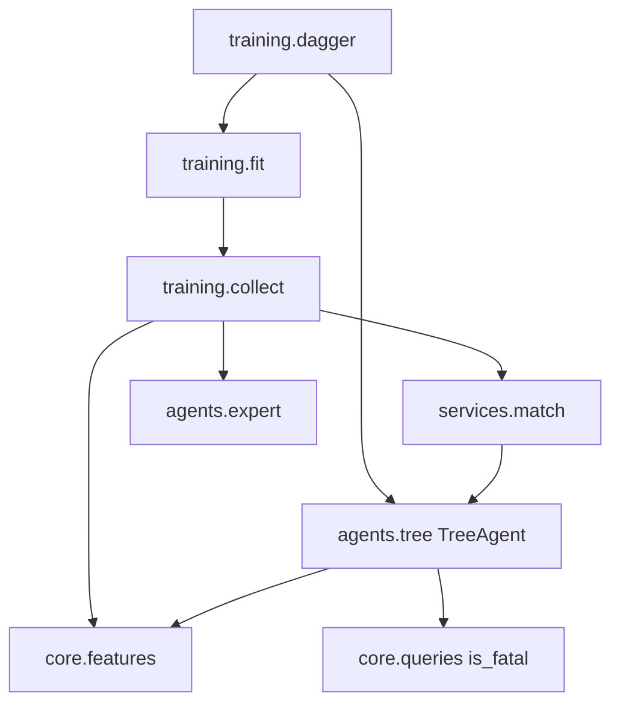

# U5 Behavior Cloning — Functional Design Plan

**Unit**: `u5-bc`
**Scope**: `agents.tree` (`TreeAgent`, `safety_mask`, `ExplanationPayload` concreto), `training.*` (coleta, split congelado, fit 3/6/8, DAgger), artefatos `bc_depth{3,6,8}.joblib` + JSON irmão, alerta D12 (100 partidas)
**Depends on**: U1 (`State`, `is_fatal`, `engine.step`), U2 (`extract_features`, `feature_names`, `FEATURE_SCHEMA_VERSION = 1`), U3 (`ExpertAgent`, `RandomAgent`, `MatchService`, `ExplainingAgent` / `ActResult`, `evaluation.scoring`, `evaluation.batch`, `agents.registry`)
**Out of this unit**: Pygame / erro 4 em PT (U4); dicionário PT e render do payload (U7); torneio 500 / estresse / ruído / meta 40% vs especialista (U7); VIPER / Gymnasium (U6, fora desta versão)
**NFR stages**: **pulados** (D27). O próximo estágio após a aprovação deste FD é **U5 Code Generation**.

No application code in this stage.

## Execution checkboxes

- [x] Analyze unit context (`unit-of-work.md`, `components.md`, `component-methods.md`, D12/D16/D21/D24/D27/D28/D30/D40/D45)
- [x] Collect answers in this file (`[Answer]:` tags)
- [x] Resolve ambiguities — Q2/Q4/Q5/Q7/Q9 notes were fully specified; registered as D50
- [x] Write `aidlc-docs/construction/u5-bc/functional-design/domain-entities.md`
- [x] Write `aidlc-docs/construction/u5-bc/functional-design/business-rules.md`
- [x] Write `aidlc-docs/construction/u5-bc/functional-design/business-logic-model.md`
- [x] Document **Propriedades Testáveis** (PBT-01) — 13 properties
- [x] Present two-option Functional Design completion (next: U5 Code Generation)

## Locked (do not re-ask)

| Topic | Source |
| --- | --- |
| `TreeAgent` is the only `ExplainingAgent`; `decide(state, snake_id) -> ActResult`; `act` = `decide(...).action` | D45 |
| No `explain(state)`, no `last_explanation` on the agent | D45 |
| `from_joblib(path, safety_mask)` fails (erro 4) if the file is missing **or** sklearn / numpy / `FEATURE_SCHEMA_VERSION` diverge from the sibling JSON | D28 / D45 |
| `FEATURE_SCHEMA_VERSION` is already `1` in U2 | D38 |
| `safety_mask` uses `is_fatal` only: deterministic deaths this tick (wall, body, obstacle, D14c tail). Head-to-head possibilities are **not** vetoed | D24 |
| Veto → safe action with largest `predict_proba`; if every action is fatal, keep the tree's original action | D24 |
| Mask default **off**; **on** for Difícil (BC-8). U5 exposes the flag; U4 chooses it | requirements / D12 |
| Product models are exactly depths **3, 6, 8** with `class_weight="balanced"` | D21 / requirements |
| Test set frozen **before** DAgger; DAgger only grows the training set | D21 |
| DAgger 3–5 iterations, on the three product depths, not on a grid winner | requirements |
| ≥ 100 000 samples from expert vs expert **and** expert vs random; split 80/20 **by match** | requirements |
| Accuracy ≥ 95% on the frozen test set for **BC-6 and BC-8**; BC-3 has **no** accuracy floor | D16 |
| BC-6 **and** BC-8 ≥ 90% vs random (1/0.5/0) over 500 matches; draw rate reported separately | D22 / D30 |
| Inference < 1 ms = `extract_features` + `predict_proba` + `safety_mask` (ALERTA convention of D40) | D40 |
| U5 D12 check: 100 matches BC-8 (mask on) and BC-6 vs expert; report the score-rate gap; **alert only** | D27 |
| 40% vs expert, +10 pp D12 over 500, noise ≤ 15 pp → **U7** | D12 / D30 |
| U7 only translates and renders the payload; it does not recompute the tree path | D30 / D45 |
| sklearn version pinned in `pyproject.toml` **and** written into each model's JSON | D28 |
| New RNG streams may only be added in `core/rng.py` (D48) | D48 |
| Layering: `core` ← `agents` ← `services` ← (`training`, `evaluation`) ← `scripts` | D48 |
| `TreeAgent` pays `ValueError` on a dead snake or terminal state, like the U3 agents | BR-AGT-5 |
| Python ≥ 3.13; `numpy==2.2.6`; no pygame in `agents/` or `training/` | D37 / RNF07 |
| No commits or tags unless explicitly requested | user standing rule |

## Module flow

Text alternative: `training.collect` plays matches through `services.match`, labels states with the expert, and extracts the U2 feature vector. `training.fit` trains the three product trees. `training.dagger` lets a student play, asks the expert to label those states, and refits. `TreeAgent` reads features and `is_fatal`, never stores an explanation, and returns `ActResult` for `on_tick`.

---

# Questions

Fill every `[Answer]:` below. Do not answer in chat.

## Question 1
The product models have `max_depth` ∈ {3, 6, 8} and `class_weight="balanced"`. The grid over `min_samples_leaf` and `criterion` is experimental only. What values do the **delivered** trees use for those two?

A) `min_samples_leaf=1`, `criterion="gini"` — sklearn defaults; the grid stays in a report script and never changes the three product files

B) `min_samples_leaf=2`, `criterion="entropy"` — slightly more regularised, one documented pair for all three depths

C) Chosen during Code Generation by a short recorded search on the frozen split, then written into each JSON; this plan only requires that all three product models share the same pair

X) Other (please describe after [Answer]: tag below)

[Answer]:A

## Question 2
DAgger is specified as 3–5 iterations on the three product depths. How many iterations does U5 actually run?

A) **3** — cheapest that still satisfies the wording; enough to measure the D12 alert

B) **5** — the top of the range, more student-state coverage

C) **4** — middle of the range

X) Other (please describe after [Answer]: tag below)

[Answer]:B — e registrar acurácia no teste congelado e taxa vs. aleatório ao fim de CADA iteração, para ver a curva.

## Question 3
The 100 000 samples come from expert vs expert **and** expert vs random. How is that mix produced, and whose `(state, action)` pairs are kept?

A) Half the matches expert vs expert, half expert vs random. Keep **only the expert side** in both pairings (the random agent's actions are never labels)

B) Two-thirds expert vs expert, one-third expert vs random. Keep only the expert side

C) All matches are expert vs expert for the initial BC; expert vs random appears only as the student/opponent pairing **inside DAgger**

X) Other (please describe after [Answer]: tag below)

[Answer]:A

## Question 4
How is a collected sample stored on disk (so the frozen test set can be reloaded without replaying matches)?

A) One `.npz` with `X` (float64, shape `(n, 20)`), `y` (int8 action index in `_ACTIONS` order), `match_id` (int) — split-by-match is then a grouping on `match_id`

B) JSONL, one object per tick: `seed`, `tick`, `snake_id`, `features`, `action` — human-readable, heavier

C) Replay log only (`seed`, `sides`, `agent specs`); features are recomputed by replaying `play(..., on_tick=...)` — no feature matrix is persisted

X) Other (please describe after [Answer]: tag below)

[Answer]: X — .npz como na A, com colunas extras por amostra: seed, tick, snake_index, pairing (expert_vs_expert, expert_vs_random, dagger) e dagger_iter; e metadados no arquivo: FEATURE_SCHEMA_VERSION, versão do numpy, feature_names.

## Question 5
The PRD lists `models/bc_depth{3,6,8}.joblib` as **delivered** artefacts. What does U5 Code Generation actually put in the repository?

A) The training pipeline **and** the three fitted `.joblib` + sibling JSON, committed under `models/` so U4 can load them without retraining

B) Pipeline and scripts only; the three files are produced by a documented `scripts/train_bc.py` run that is **not** part of the default pytest. U4 fails with erro 4 until that script is run once

C) Pipeline plus **tiny fixture models** (few samples) for tests; the real 100 k / DAgger artefacts are produced off the default path and committed only when you ask

X) Other (please describe after [Answer]: tag below)

[Answer]:C — com dois complementos: DecisionTreeClassifier com random_state fixo, e os três modelos reais commitados em models/ antes de começar a U4.

## Question 6
When the mask vetos and two safe actions share the same `predict_proba`, how is the replacement chosen? (A draw here must stay a pure function of `(state, snake_id)`.)

A) First in `_ACTIONS` order among the tied safe actions (`straight` before turns) — no RNG

B) One draw from the existing agent stream `[seed, 3_000_003, tick, snake_index]` (D44), same helper the expert uses on a left/right tie

C) Prefer `straight` if it is in the tie, otherwise one agent-stream draw between the two turns

X) Other (please describe after [Answer]: tag below)

[Answer]:C

## Question 7
`ExplanationPayload` is an empty Protocol in U3. What is the **concrete** frozen payload U5 puts in `ActResult.explanation`, so U7 can translate without calling sklearn?

A) `TreeExplanation(proposed: Action, executed: Action, vetoed: bool, path: tuple[PathStep, ...])` where each `PathStep` is `(feature_name: str, threshold: float, went_left: bool)` taken from sklearn's `decision_path` / `tree_.feature` / `tree_.threshold`

B) Same four top-level fields, but `path` is a single English string from `sklearn.tree.export_text` (U7 would have to parse it)

C) Only `proposed`, `executed`, `vetoed` plus the raw `decision_path` sparse row (indices of nodes). U7 walks `tree_` itself — this **breaks** D30 ("U7 does not recompute the path") unless U7 also loads the joblib

X) Other (please describe after [Answer]: tag below)

[Answer]:X — Opção A, com dois campos a mais: proba (probabilidade das três ações, na ordem de _ACTIONS) e, em cada PathStep, o valor real da feature naquele estado.

## Question 8
`from_joblib` must fail on a missing file or a version / schema mismatch (erro 4). What does the **library** raise? Portuguese copy is U4.

A) A dedicated `ModelLoadError` (subclass of `Exception`) with an English `code="model_load"` and a machine-readable `reason` ∈ `{missing, sklearn, numpy, schema}`; U4 maps `reason` to the Portuguese erro 4 text

B) `FileNotFoundError` for a missing file and `ValueError` for a mismatch — no new type; U4 inspects the exception class

C) `RuntimeError` with a Portuguese message already inside, so U4 can show `str(exc)` as-is

X) Other (please describe after [Answer]: tag below)

[Answer]:A

## Question 9
Which scikit-learn version is pinned (must also be written into every model JSON)?

A) `scikit-learn==1.6.1` — current 1.6 line, known to install on Python 3.13

B) `scikit-learn==1.5.2` — previous 1.5 line, only if 1.6 is rejected on this machine during Code Generation

C) Pin whatever `pip` resolves on this machine during Code Generation and record the exact `X.Y.Z` in `decisions.md`; this plan only requires an exact pin, not a pre-chosen triple

X) Other (please describe after [Answer]: tag below)

[Answer]:C — conferindo que a versão resolvida é compatível com numpy==2.2.6.

## Question 10
Does U5 add a `"tree"` spec to `agents.registry` so `evaluation.batch` can play batteries under Windows `spawn`?

A) Yes — `AgentSpec("tree", {"path": "...", "safety_mask": true|false})`; `build_agent` calls `TreeAgent.from_joblib`

B) No — batteries that need a tree construct `TreeAgent` in-process; only `random` / `expert` / `human` stay in the registry (tree objects are not sent across `spawn`)

C) Yes, but the spec carries **bytes** of the joblib (pickled) instead of a filesystem path, so a worker does not need the file on disk

X) Other (please describe after [Answer]: tag below)

[Answer]:A
