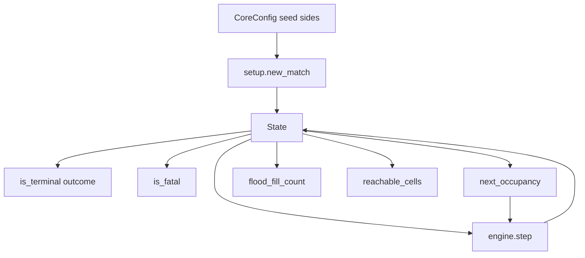

# U1 Core — Business Logic Model

Algorithms for setup, tick, and queries. No UI, agents, or features.

## Data flow



Text alternative:

```
CoreConfig + seed + sides -> new_match -> State
State + snake_id + Action -> next_occupancy
State + two Actions -> step (uses next_occupancy) -> State
State -> is_terminal / outcome
State + snake_id + Action -> is_fatal
State + Cell [+ occupancy] -> flood_fill_count / reachable_cells
```

```
+---------------------------+
| new_match -> State        |
| State -> step -> State    |
| State -> queries          |
+---------------------------+
```

## Entropy (D31)

Python `hash()` is forbidden (process-salted, not stable).

| Stream | `SeedSequence` | Used for |
| --- | --- | --- |
| Obstacles | `[seed_k, 0]` | Pair sampling; `seed_k = seed + k * 1000003` |
| Food respawn | `[match_seed, tick]` | `tick` after the eating step (`1..max_ticks`) |
| U1 random helper | `[match_seed, 2000003]` | 1000-match test only; not production setup |

## setup.new_match

Inputs: `CoreConfig`, `seed: int`, `sides: SnakeId -> Side`.

1. Build snake A and B from D25 templates according to `sides`.
2. `obstacles = empty`. Place kickoff food with the D26 cyclic scan from `(10, 9)` (BR-F1).
3. If `obstacle_count == 0`, skip to step 8.
4. `n = obstacle_count` if even else `obstacle_count + 1`. `k = 0`.
5. `seed_k = seed + k * 1000003`. `rng = default_rng(SeedSequence([seed_k, 0]))`.
6. **Forbidden set**: Chebyshev r=2 around each head and the ahead cell; initial bodies; kickoff food.
7. **Candidate unique pairs**: cells `(x,y)` whose complement `c = (W-1-x, H-1-y)` satisfies `(x,y) < c` lexicographically; neither cell in forbidden; both in-bounds. Shuffle with `rng` and take `n/2` pairs. If not enough pairs, this attempt fails.
8. **Connectivity**: 4-flood from any free cell; free = in-bounds, not obstacle, not initial body. If the visited count ≠ number of free cells, fail the attempt.
9. On fail: `k += 1`; if `k == 100`, raise `SetupError`; else go to 5.
10. Return `State` with `tick=0`, `end_reason=None`, recorded `seed`, both snakes alive, `death_cause=None`.

Same inputs ⇒ same `State` (BR-P3).

## engine.step

Pure: read-only on the input; return a new `State`.

### If terminal
Return `copy(state)` (tick unchanged).

### Otherwise

1. `dir_a' = apply(action_a, snake_A.direction)` (same for B).
2. `next_a = head_a + delta(dir_a')` (same for B).
3. `intends_eat[id] = (food is not None and next[id] == food)`.
4. `swap = (next_a == head_b and next_b == head_a)`.
5. **Classify each snake** using `occ = next_occupancy(state, id, action, opponent_action)` with the **real** opponent action (D33; no second occupancy implementation):
   - Out of board → dead `wall`.
   - `next` in `obstacles` → dead `obstacle`.
   - `next == opponent_pre_tick_head` **and** `swap` → leave as H2H candidate (do **not** mark body).
   - `next` ∈ `occ` → `self_body` if `next` is in own pre-tick body, else `opponent_body` (includes ramming the opponent head **without** swap: that cell is the opponent's neck).
   - Else still a candidate for same-`next` H2H / survival.
6. **H2H** among snakes **not** already dead in step 5, and only if `next_a == next_b` **or** `swap`:
   - If **both** are still candidates: shorter dies `head_to_head`; equal length → both `head_to_head`.
   - If **exactly one** is still a candidate: **that snake survives**. Do not apply the size rule. The other already has a `death_cause` from step 5.
   - If neither is a candidate: both already classified; stop.

Mandatory examples:
- D32: A head `(5,5)` facing `E`, B head `(6,5)` facing `N`, both `straight`. `next_a=(6,5)=head_b`, `next_b=(6,4)≠head_a` → not `swap`. A: `(6,5)` ∈ occ → `opponent_body`. B lives.
- D33: B's head is 4-adjacent to food; B turns and does **not** eat; A steps into B's tail cell. `step` uses real `opponent_action` → tail vacates → **A survives**. (`is_fatal` without `opponent_action` may still say fatal.)

7. **Apply bodies** for survivors: new head prepended; if `intends_eat` and still alive, keep tail (grow); else drop tail.
8. **Food**: if exactly one survivor has `intends_eat`, consume and respawn (BR-F2, BR-F3). If both died on food, keep food (BR-F4). If both intended eat but one survived (unequal H2H), that survivor consumes.
9. `tick' = tick + 1`.
10. If any dead: `end_reason = death`. Elif `tick' >= max_ticks`: `end_reason = timeout`. Else `None`.
11. Facing of each **living** snake becomes `dir'`. Dead snakes keep last direction and body.

### is_terminal / outcome
- Terminal iff `end_reason is not None`.
- `outcome` as BR-L5; undefined (do not use) if not terminal.

## queries.next_occupancy

`next_occupancy(state, snake_id, action, opponent_action=None) -> frozenset[Cell]`

Cells still solid **this tick** from `snake_id`'s point of view:

- All current body cells of both snakes.
- Remove **own** tail iff this `action` does not land on food.
- Opponent tail:
  - `opponent_action` set: remove iff opponent `next_head != food` (real eat).
  - `opponent_action is None`: remove iff opponent head is **not** 4-adjacent to food (D29 conservative).
- Always includes both current heads.

Obstacles are **not** in this set (checked separately).

Callers (D33):

| Caller | `opponent_action` |
| --- | --- |
| `engine.step` passo 5 | **real** opponent action |
| `is_fatal` | omitted (`None`) |
| U2 features / U3 expert | omitted (`None`) |

## queries.is_fatal

Does **not** call `step` in production; `step` is the PBT oracle.

`next` from `action` on `snake_id`. Fatal iff:

1. Out of board, or
2. `next` in `obstacles`, or
3. `next` ∈ `next_occupancy(state, snake_id, action)` (`opponent_action` omitted — conservative, D33).

The opponent's **current head is FATAL** (D32 conservative). The engine may still spare the **larger** snake on a **swap**; `is_fatal` does not try to predict that. Meeting on a third cell (`next_a == next_b`, not a current head) is H2H in the engine and is **not** `is_fatal`.

Docstring must state: D29 tails; opponent head fatal; swap may survive in `step` if larger.

## queries.flood_fill_count / reachable_cells

Shared walk: BFS, 4-neighbors, stop at `limit` (default 200).

- Blocked: OOB, `obstacles`, and `occupancy` if provided, otherwise all current body cells.
- Food is walkable.
- `start` already blocked → count `0` / empty frozenset.

Signatures (D32):

- `flood_fill_count(state, start, occupancy=None, limit=200) -> int`
- `reachable_cells(state, start, occupancy=None, limit=200) -> frozenset[Cell]`

No combined `flood_fill` return. U2 / expert pass `occupancy=next_occupancy(...)` when they need post-move bodies.

## 1000 random matches (test only)

For seeds `0..999` (or a documented fixed list): `new_match` then loop `step` with two actions drawn from `default_rng(SeedSequence([seed, 2000003]))`, uniform over the three `Action`s, A then B each tick, until terminal. Assert no exception; `outcome` in `{win_a, win_b, draw}`; `tick <= 1800`.

## Error handling

| Case | Behavior |
| --- | --- |
| Obstacle retries exhausted | `SetupError` with attempt count |
| `step` after terminal | Identity copy |
| `food is None` | No eat, no respawn |
| Invalid `Action` | Not in the type; tests need not cover a fourth action |

## Propriedades Testáveis (PBT-01)

Blocking in this project: PBT-02, PBT-03, PBT-07, PBT-08, PBT-09. PBT-01/04/05/06 advisory.

| ID | Component | Property | Category | Binding rule |
| --- | --- | --- | --- | --- |
| P-COPY | `state.copy` | `copy(s)` equals `s`; alias-free | Round-trip | PBT-02 |
| P-FATAL | `is_fatal` | If False, for **each** opponent `Action`, `step` does not assign the tested snake `wall`, `obstacle`, `self_body`, or `opponent_body`. Applies to **all** cells (no head exemption). `head_to_head` (same `next` or swap) does not fail the property | Oracle + invariant | PBT-03, D28, D30, D32 |
| P-OCC | `next_occupancy` / `step` | After `state' = step(state, a, b)`, for each living snake S: `set(body_S[1:])` equals `next_occupancy(state, S, action_S, action_opponent) ∩ set(pre_tick_body_S)` (real opponent action; leftovers excluding **new** heads) | Oracle | PBT-03, D33 |
| P-OCC-CONSERV | `next_occupancy` | For every state, action, and opponent action: `next_occupancy(s, id, a) ⊇ next_occupancy(s, id, a, opponent_action)`. Conservative never frees a cell the real version blocks | Invariant | PBT-03, D33 |
| P-ENG-NOOVERLAP | `step` | After any `step`, all cells of **living** snakes are pairwise distinct (no overlap between snakes or within one body) | Invariant | PBT-03, D32 |
| P-SETUP-SYM | `new_match` | Every obstacle `c` has complement `rot180(c)` in the set | Invariant | PBT-03, D30 |
| P-SETUP-CONN | `new_match` | All free cells (not obstacle, not initial body) are one 4-component | Invariant | PBT-03, D29 |
| P-SETUP-ZONE | `new_match` | No obstacle in Chebyshev r=2 heads/ahead, bodies, or kickoff food | Invariant | PBT-03, D26 |
| P-SETUP-DET | `new_match` | Same `(config, seed, sides)` → equal `State` | Invariant | PBT-03, D30 |
| P-ENG-FOOD | `step` | At most one food cell; if both alive and food was a cell, still a cell unless BR-F6 | Invariant | PBT-03 |
| P-ENG-LEN | `step` | Alive snakes have length ≥ 3 | Invariant | PBT-03 |
| P-ENG-OUT | `outcome` | At most one winner or a draw; never two winners | Invariant | PBT-03 |
| P-ENG-OBS | `step` | Obstacle set unchanged; entering one kills `obstacle` | Invariant | PBT-03 |
| P-GEN | tests | Generators for legal `State`, snakes, seeds, actions | Generators | PBT-07 |
| P-PLACE | tests | Tests under `tests/` mirroring `core/` | Placement | PBT-08 |
| P-SHRINK | tests | Hypothesis shrinks failures to a minimal example | Shrink | PBT-09 |

### Components without extra PBT
`is_terminal` / `outcome` are thin projections of `end_reason` and lengths — covered by P-ENG-OUT, not a separate generator family.

### Idempotence (advisory PBT-04)
`step` on a terminal state is idempotent on observable fields (`step(step(t))=step(t)` for terminal `t`). Documented for later optional tests; not blocking.

## Code-generation notes (not this stage)

Public functions: type hints. Package `snake_vs_machine.core`. Tests: BR-M7, BR-Q3 (including A `(5,5)` E / B `(6,5)` N both `straight`), BR-F4, plus PBT table. Coverage gate BR-A3.
