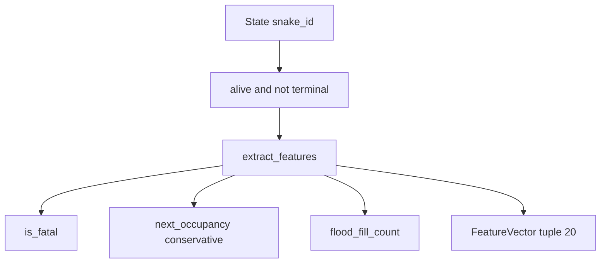

# U2 Features — Business Logic Model

Algorithms for `extract_features`. No agents, UI, or sklearn.

## Data flow



Text alternative:

```
State + snake_id
  -> reject if dead or terminal (ValueError)
  -> danger via is_fatal
  -> dist_danger ray via next_occupancy
  -> space_free via flood_fill_count
  -> food / manhattan / head_risk / length_diff
  -> tuple[20]
```

```
+-----------------------------+
| extract_features            |
| queries: fatal occ flood    |
| out: tuple of 20            |
+-----------------------------+
```

## extract_features(state, snake_id)

1. If `state.end_reason is not None` or `not state.snake(snake_id).alive`: raise `ValueError`.
2. `me = state.snake(snake_id)`, `opp = state.opponent(snake_id)`.
3. For `d` in `{ahead, left, right}` let `action_d` be `straight` / `turn_left` / `turn_right`.
4. `landing_d, _ = next_head(me.head, me.direction, action_d)`.
5. `occ_d = next_occupancy(state, snake_id, action_d)` (no opponent action).
6. `danger_d = 1` if `_blocked(state, landing_d, occ_d)` else `0` — equivalent to `is_fatal(state, snake_id, action_d)` but reuses `occ_d` (D43).
7. `dist_danger_d = _ray(state, landing_d, facing_after_action_d, occ_d)`.
8. `space_free_d = 0` if `danger_d` else `_space(state, landing_d, occ_d)`. Use **`flood_fill_count` only** — never `len(reachable_cells(...))` when `limit` may truncate (D39).
9. Fill food bits, `dist_food`, `opponent_closer_to_food`, `dist_opponent_head` (see below).
10. `head_risk_d = 1` if `landing_d` is in-bounds and equals any in-bounds cell among `{next_head(opp.head, opp.direction, a)[0] for a in Action}`.
11. `length_diff = me.length - opp.length`.
12. Return the 20-tuple in `feature_names()` order.

Reuse `occ_d` for the ray and the flood occupancy of the same `d` (one occupancy call per direction).

### _ray

Facing for the ray = direction after `action_d` (the ray continues straight that way).

```
if landing blocked (not in_bounds or obstacle or landing in occ_d):
    return 0.0
count = 0
cell = landing
while in_bounds(cell) and cell not in obstacles and cell not in occ_d:
    count += 1
    cell = cell + delta(ray_facing)
return min(1.0, count / max(width, height))
```

Landing blocked ⇒ `0`, which matches `is_fatal` on that action (BR-FTR-D4).

### _space

`free_cells` = `width*height - len(obstacles) - len(me.body) - len(opp.body)` (D42). Valid because living bodies never overlap each other (P-ENG-NOOVERLAP) nor obstacles. Computed **once** per `extract_features` and passed into `_space`.

If `free_cells <= 0`: return `0.0`.

`n = flood_fill_count(state, landing, occupancy=occ_d, limit=200)`.

Return `min(1.0, n / min(200, free_cells))`.

### Food bits and Manhattan

Head-frame dots: `v = (food.x - me.head.x, food.y - me.head.y)`.

`ahead = v·forward > 0`, `behind = v·forward < 0`, `left = v·left > 0`, `right = v·right > 0`.

`manhattan(a, b) = |ax-bx| + |ay-by|`.

Divisor `width + height - 2` (max Manhattan on the grid). Clip `[0, 1]`.

`food is None` or food on `me.head`: four bits `0`, `dist_food = 1.0`, closer `0`.

### Opponent next heads

Three landings; drop if `not in_bounds`. Equality only (not 4-adjacency of current head).

## Board transforms (tests)

See `domain-entities.md`. After a rotation, `extract_features` equals the pre-image vector. After a central-axis mirror, swap index pairs `(1,2)`, `(4,5)`, `(7,8)`, `(10,11)`, `(17,18)` (`left`/`right` of danger, dist_danger, space_free, food, head_risk).

## Propriedades Testáveis (PBT-01)

Blocking in this project: PBT-02, PBT-03, PBT-07, PBT-08, PBT-09.

| ID | Target | Statement | Kind | Trace |
| --- | --- | --- | --- | --- |
| P-FEAT-DET | `extract_features` | Same `(state, id)` → equal tuple | Invariant | PBT-02 |
| P-FEAT-RANGE | `extract_features` | Domains in BR-FTR-S3 | Invariant | PBT-03 |
| P-FEAT-ROT | `extract_features` | Whole-board rot 90/180/270 about center → same vector (`width == height`) | Invariant | D19, D38 |
| P-FEAT-MIRROR | `extract_features` | Whole-board `x` or `y` flip → left ↔ right slots; others unchanged | Invariant | D19, D38 |
| P-FEAT-DANGER-DIST | pair | `danger_d == 1` iff `dist_danger_d == 0` | Invariant | D38 |
| P-FEAT-DANGER-SPACE | pair | `danger_d == 1` implies `space_free_d == 0` | Invariant | D38 |
| P-FEAT-DEAD | `extract_features` | Dead snake or terminal state → `ValueError` | Oracle | D38 |
| P-FEAT-FREECELLS | `_free_cell_count` | Arithmetic formula equals the cell-by-cell scan | Oracle | D42 |
| P-FEAT-DANGER | `_blocked` | For every action, `_blocked(state, landing, occ) == is_fatal(state, id, action)` | Oracle | D43 |
| P-GEN | tests | `new_match` + `step`; filter terminal; then optional transform | Generators | PBT-07, D36 |
| P-PLACE | tests | `tests/core/test_features.py` (and PBT module) | Placement | PBT-08 |
| P-SHRINK | tests | Hypothesis shrinks | Shrink | PBT-09 |

Idempotence (advisory PBT-04): `extract_features` twice on the same state is equal (follows from purity).

## Worked examples (mandatory in tests)

1. **Replaced by D39 items 2–3** (golden vector + fairness). Do not use the old “food_ahead only” kickoff sketch.
2. Golden kickoff: `new_match(CoreConfig(), seed=0)`, snake A, full vector  
   `(0, 0, 0, 0.85, 0.10, 0.85, 1.0, 1.0, 1.0, 1, 0, 1, 0, 15/38, 0, 30/38, 0, 0, 0, 0)`  
   with `pytest.approx` on floats.
3. Fairness: same kickoff, `extract_features(state, A) == extract_features(state, B)`.
4. A about to walk into a wall: `danger_ahead = 1`, `dist_danger_ahead = 0`, `space_free_ahead = 0`.
5. Food on a diagonal in the head frame: two of `food_*` are 1.
6. Equal Manhattan to food: `opponent_closer_to_food = 0`.
7. Landing equals one opponent next head: that `head_risk_* = 1`.
8. Terminal or dead: `ValueError`.

## Out of U2

`safety_mask`, expert A*, training, UI labels. U5 consumes `FEATURE_SCHEMA_VERSION` and `feature_names()`.
