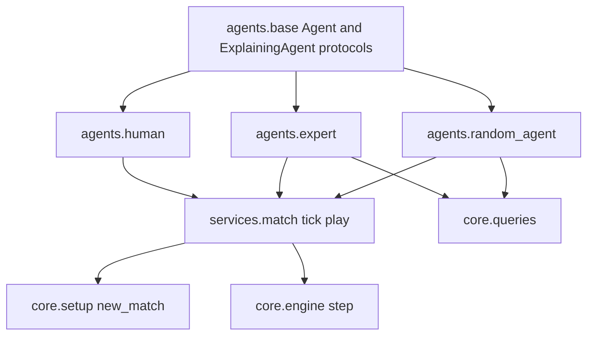

# U3 Agents + MatchService — Business Logic Model

## Module flow



Text alternative: `agents.base` declares the `act` contract; `random_agent`, `expert` and `human` implement it. `services.match` builds the match through `core.setup` and advances it through `core.engine`, asking the two agents for actions. Only `random_agent` and `expert` read `core.queries`.

## Tick RNG (shared by every agent draw)

```text
_AGENT_STREAM = 3_000_003
snake_index(SnakeId.A) = 0
snake_index(SnakeId.B) = 1

rng = default_rng(SeedSequence([state.seed, _AGENT_STREAM, state.tick, snake_index]))
```

Derived from the state, so it costs nothing to reproduce and keeps the agents pure (D44 item 3).

Built **lazily** (D46 item 8): construction measures 31.3 µs, more than `engine.step`, so the expert only builds it when a left/right tie actually has to be broken. The `RandomAgent` needs it every tick by definition.

## RandomAgent.act

1. Reject terminal state / dead snake with `ValueError` (BR-AGT-5).
2. `candidates = [a for a in _ACTIONS if not is_fatal(state, snake_id, a)]`.
3. If `candidates` is empty, `candidates = list(_ACTIONS)`.
4. Return `candidates[int(rng.integers(len(candidates)))]`.

## ExpertAgent.act

`act` returns `_decide(state, snake_id).action`. `_decide` is private so tests can read `stage` and `drawn`.

### Step 1 — evaluate the three actions

For each `action` in `_ACTIONS`:

```text
landing, facing = next_head(me.head, me.direction, action)
occ             = next_occupancy(state, snake_id, action)          # conservative, D33
fatal           = not in_bounds(landing) or landing in obstacles or landing in occ
head_risk       = in_bounds(landing) and landing in opponent_next_heads
flood           = flood_fill_count(state, landing, occupancy=occ, limit=200)
food_distance   = distances[landing]        # from the single BFS of step 2
```

`opponent_next_heads` = the opponent's three `next_head` results that are in bounds — the same set U2 uses for `head_risk_*`.

### Step 2 — `_food_distances`: one BFS from the food (D46 item 3)

A single BFS **from the food outward** fills the distance of all three landings:

1. `state.food is None` → every `food_distance` is `None`.
2. `blocked` = `state.obstacles ∪ next_occupancy(state, snake_id, a)` for any action `a` that does **not** land on the food (own tail released, opponent tail by D29).
3. BFS from `state.food` over row-major integer indices, the technique of U1's `_flood_indices` (D43), no cap — it is a distance over the whole board.
4. Each action reads `distance[landing]`; a landing not reached is `None`; a landing that **is** the food is `0` (BR-EXP-5).

**Why this is exact, not an approximation.** `next_occupancy` differs between the three actions in exactly one cell: the own tail, which stays solid only when that action eats the food. So:

- If no action lands on the food, all three occupancies are identical and the shared blocked set is the right one for each.
- The only action that could have a different occupancy is the one landing on the food, and its distance is `0` by definition — it never consults the BFS.
- The shared set (tail released) is a **subset** of the eating action's occupancy, so a non-fatal landing is never blocked in it.
- The grid is undirected, so the distance from the food to a cell equals the distance from that cell to the food.

Cost: one BFS per `act` instead of three, which is what keeps the expert inside the 1 ms budget of D46 item 2.

**Placement note**: `_food_distances` is private to `agents/expert.py`. It is not added to `core.queries`, so U1 stays frozen. If U7 or `evaluation` later needs the same distances, promote it to `core.queries` then — not now.

### Step 3 — filter

```text
S1 = [e for e in evaluations if not e.fatal]
S2 = S1 if me.length > opp.length else [e for e in S1 if not e.head_risk]
S3 = [e for e in S2 if e.flood > me.length]
```

### Step 4 — rank and fall back

| Case | Rule | `stage` |
| --- | --- | --- |
| `S3` non-empty | rank by `food_distance` ascending (`None` last) → `flood` descending → `straight` first | `ranked` |
| `S3` empty, `S2` non-empty | largest `flood` → `straight` first | `fallback_space` |
| `S2` empty, `S1` non-empty | largest `flood` → `straight` first | `fallback_head_risk` |
| `S1` empty | `straight` | `all_fatal` |

A remaining tie **between `turn_left` and `turn_right`** is resolved by one `rng.integers(2)` draw and sets `drawn = True` (BR-EXP-11). `straight` never enters a draw: it always wins its own ties.

## HumanAgent

### push_absolute(direction)

1. If `len(_buffer) == 2` → **ignore the command** and return (D45 item 2).
2. `effective = _buffer[-1] if _buffer else _last_direction`.
3. If `effective is not None` and `direction is effective` → drop (redundant).
4. If `effective is not None` and `direction is reverse(effective)` → drop (D13).
5. Append.

The full-buffer check comes **first**: the validation chain is what makes the buffer safe, so the tail is never sacrificed to admit a newer key.

`reverse(d)` = two left turns applied to `d`.

### act(state, snake_id)

1. `_last_direction = state.snake(snake_id).direction`.
2. Empty buffer → `straight`.
3. Pop the oldest command `target`:
   - `target is direction` → `straight`
   - `target is left_of(direction)` → `turn_left`
   - `target is right_of(direction)` → `turn_right`
   - otherwise (reverse) → `straight` (defensive, BR-HUM-9)

## services.match

```text
def _ask(agent, state, snake_id) -> ActResult:
    if isinstance(agent, ExplainingAgent):          # runtime_checkable Protocol
        return agent.decide(state, snake_id)
    return ActResult(agent.act(state, snake_id), None)

def _tick_with_results(state, agent_a, agent_b) -> tuple[State, ActResult, ActResult]:
    if state.end_reason is not None: raise ValueError
    result_a = _ask(agent_a, state, SnakeId.A)
    result_b = _ask(agent_b, state, SnakeId.B)
    return engine.step(state, result_a.action, result_b.action), result_a, result_b

def tick(state, agent_a, agent_b) -> State:
    return _tick_with_results(state, agent_a, agent_b)[0]

def play(agent_a, agent_b, config, seed, sides=(Side.NW, Side.SE), on_tick=None) -> MatchResult:
    state = new_match(config, seed, sides)
    while not engine.is_terminal(state):
        before = state
        state, result_a, result_b = _tick_with_results(state, agent_a, agent_b)
        if on_tick is not None:
            on_tick(before, result_a, result_b, state)
    return _result(state)
```

`_ask` is the only place that knows about explanations, and it asks each agent exactly once per tick (BR-MS-1b). `ExplanationPayload` stays opaque to `services.match`.

`_result` records `engine.outcome(state)` and copies the finished-match facts listed in `domain-entities.md`. It does **not** compute a score: that belongs to `evaluation/scoring.py` (D48 item 5).

## Propriedades Testáveis (PBT-01)

| ID | Target | Property | Type | Source |
| --- | --- | --- | --- | --- |
| P-AGT-ACTION | every agent | `act` returns one of the three relative actions | Invariant | BR-AGT-2 |
| P-AGT-PURE | random, expert | Same `(state, snake_id)` → same action, across fresh instances | Determinism | D44 item 3 |
| P-AGT-FROZEN | every agent | `state` is unchanged after `act` | Invariant | BR-AGT-3 |
| P-RND-SAFE | `RandomAgent` | If any non-fatal action exists, the chosen action is non-fatal | Invariant | BR-RND-2 |
| P-RND-SPREAD | `RandomAgent` | Over many ticks every non-fatal action eventually appears (no silent bias to `straight`) | Statistical | BR-RND-4 |
| P-EXP-SAFE | `ExpertAgent` | If any non-fatal action exists, the expert never picks a fatal one | Invariant | BR-EXP-7 |
| P-EXP-SPACE | `ExpertAgent` | When `stage == "ranked"`, the chosen action satisfies `flood > me.length` | Invariant | BR-EXP-9 |
| P-EXP-HEADRISK | `ExpertAgent` | When `stage == "ranked"` and `me.length <= opp.length`, the chosen landing is not an opponent next head | Invariant | BR-EXP-8 |
| P-EXP-ROT | `ExpertAgent` | Rotating the whole board (U2 helpers) does not change the chosen action, except when `drawn` is True | Isometry | D44 item 2 |
| P-EXP-MIRROR | `ExpertAgent` | Mirroring the whole board swaps `turn_left` ↔ `turn_right` and keeps `straight`, except when `drawn` is True | Isometry | D49 item 2 |
| P-EXP-DET | `ExpertAgent` | Two calls on the same state agree, draws included | Determinism | BR-EXP-14 |
| P-EXP-DIST | `_food_distances` | The single BFS from the food agrees, for every non-fatal landing, with a per-landing BFS using that action's own occupancy | Oracle | BR-EXP-5b / D46 |
| P-HUM-CAP | `HumanAgent` | `len(buffer) <= 2` after any push sequence, and a push onto a full buffer leaves it **unchanged** | Invariant | BR-HUM-1 |
| P-HUM-CHAIN | `HumanAgent` | Draining the buffer tick by tick never yields a reverse, for any push sequence — the property that motivates BR-HUM-1 | Invariant | BR-HUM-11 |
| P-HUM-FILTER | `HumanAgent` | No buffered command is redundant or the reverse of its predecessor | Invariant | BR-HUM-3/4 |
| P-HUM-ONE | `HumanAgent` | Each `act` removes exactly one command when the buffer is non-empty, zero when empty | Invariant | BR-HUM-10 |
| P-HUM-NOREV | `HumanAgent` | `act` never returns an action that reverses the current direction | Invariant | BR-HUM-9 |
| P-MS-TICK | `tick` | `tick(state, a, b) == engine.step(state, a.act(state, A), b.act(state, B))` for plain agents | Oracle | BR-MS-1 |
| P-MS-DECIDE | `tick` | For an agent implementing `decide`, the applied action equals `decide(...).action`, `decide` is called once per tick, and the payload reaches `on_tick` unchanged | Oracle | BR-MS-1b |
| P-MS-TERM | `play` | Always terminates with `end_reason is not None` and `ticks <= max_ticks` | Termination | BR-MS-8 |
| P-MS-REPLAY | `play` | Same `(agents, config, seed, sides)` → identical `MatchResult` | Determinism | BR-RNG-3 |
| P-MS-SCORE | `evaluation.scoring` | The score matches `outcome`, and the two sides always sum to 1.0 | Invariant | BR-MS-7 / D48 |
| P-MS-PARITY | `evaluation.batch` | ~20 seeds played sequentially and in parallel give identical results once sorted by seed | Oracle | D48 item 3 |
| P-MS-HOOK | `play` | `on_tick` fires exactly `ticks` times, and replaying `result.action` through `engine.step` reproduces the final state | Oracle | BR-MS-6 |

Isometry note (revised by D49 item 2): a rotation preserves handedness, so the chosen action is **unchanged**; a mirror reverses it, so the expected result is `turn_left` ↔ `turn_right` swapped with `straight` fixed. The two cases therefore need two separate properties rather than one, and both skip decisions with `drawn = True`, since a coin flip has no reason to survive a transform. The `straight` preference is handedness-neutral, which is what makes the mirror expectation a clean swap instead of an exception.

## Worked examples

### 1. Expert at kickoff, snake A → `straight`

Kickoff (`new_match(CoreConfig(), seed=0)`): A body `(2,2), (1,2), (0,2)` facing `E`, B body `(17,17), (18,17), (19,17)` facing `W`, food `(10,9)`, no obstacles.

| Action | Landing | Fatal | Head risk | Flood | Food distance |
| --- | --- | --- | --- | --- | --- |
| `straight` | `(3,2)` | no | no | 200 | 14 |
| `turn_left` | `(2,1)` | no | no | 200 | 16 |
| `turn_right` | `(2,3)` | no | no | 200 | 14 |

`S1 = S2 = S3` = all three. Smallest distance 14 keeps `straight` and `turn_right`; floods tie at the 200 cap; `straight` wins the preference. Result: `straight`, `stage = "ranked"`, `drawn = False`. This is the U3 golden example, the counterpart of U2's golden vector.

### 2. Head-risk waiver by length

Two snakes whose next heads can meet on one cell, with the expert **strictly longer**. BR-EXP-8 skips the `head_risk` filter, so the contested cell stays a candidate and can be chosen — the larger snake survives the swap. With equal lengths the same board must produce a different action. Exact coordinates are fixed during code generation, together with a companion test at equal length.

### 3. Space fallback

A board where every non-fatal action leads into a pocket smaller than the body, so `S3` is empty. The decision must come from `S2` by largest flood, with `stage = "fallback_space"` — the expert picks the roomiest death-delaying move instead of raising or returning `straight`.

### 4. HumanAgent chain of two turns

A facing `E`, empty buffer, `_last_direction = E` after the first `act`.

| Call | Effective direction | Outcome |
| --- | --- | --- |
| `push_absolute(N)` | `E` | accepted → `[N]` |
| `push_absolute(N)` | `N` (last buffered) | dropped, redundant |
| `push_absolute(S)` | `N` | dropped, reverse of `N` |
| `push_absolute(W)` | `N` | accepted → `[N, W]` |
| `act` (facing `E`) | — | pops `N` → `turn_left` |
| `act` (facing `N`) | — | pops `W` → `turn_left` |

### 5. Full buffer ignores the new key (D45 item 2, mandatory test)

Snake facing **east**; the player presses `↑ ← ↓` faster than the tick rate.

| Call | Buffer before | Effective direction | Outcome |
| --- | --- | --- | --- |
| `push_absolute(N)` — `↑` | `[]` | `E` | accepted → `[↑]` |
| `push_absolute(W)` — `←` | `[↑]` | `↑` | accepted → `[↑, ←]` |
| `push_absolute(S)` — `↓` | `[↑, ←]` | — | **ignored**, buffer full |

Final buffer `[↑, ←]`, and draining it gives `turn_left` then `turn_left` — no reverse. Evicting the oldest instead would leave `[←, ↓]`: popping `←` while the snake still faces east is exactly the reverse that D13 forbids. That is why capacity is enforced before validation.
