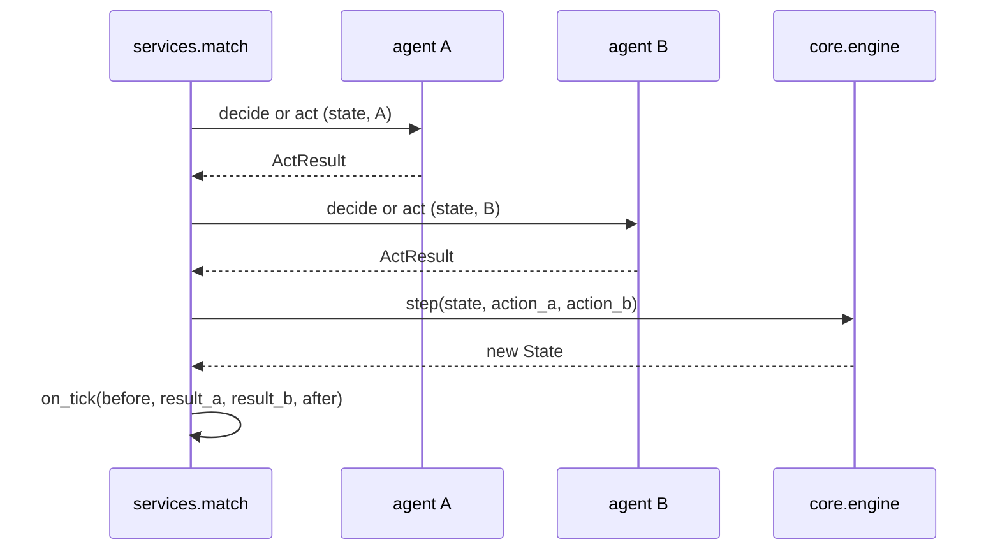
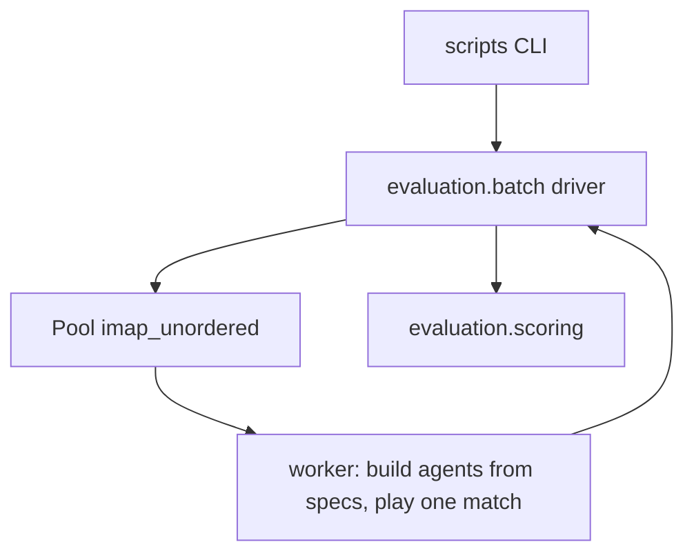

# U3 Agents + MatchService — Logical Components

No infrastructure components: no queues, caches, circuit breakers or gateways. Everything below is a Python module in one process, plus a worker pool used only for batches.

## Components delivered by U3

| Component | Responsibility | Depends on |
| --- | --- | --- |
| `core/rng.py` | **New.** Registry of every `SeedSequence` stream tag plus the generic per-tick `Generator` helper (D48 item 2) | numpy |
| `agents/base.py` | `Agent` and `ExplainingAgent` protocols, `ActResult`, `ExplanationPayload` marker | `core.state` |
| `agents/random_agent.py` | Uniform draw over non-fatal actions | `core.queries`, `core.rng` |
| `agents/expert.py` | Decision order of D44; private single BFS from the food | `core.queries`, `core.rng` |
| `agents/human.py` | Absolute-command buffer of 2, push-time filtering | `core.state` |
| `agents/registry.py` | `AgentSpec` (name + parameters) and `build_agent(spec)`, so a worker can construct agents after `spawn` (D48 item 1) | the agent modules |
| `services/match.py` | `tick`, `play`, `MatchResult`, `TickHook`; `_ask` routing between `decide` and `act` | `core.engine`, `core.setup`, `agents.base` |
| `evaluation/scoring.py` | 1 / 0.5 / 0 per match, win rate, draw rate (D48 item 5); extended by U7 | `services.match` |
| `evaluation/batch.py` | Module-level worker and the `Pool.imap_unordered` driver; order-independent aggregation | `services.match`, `agents.registry`, `evaluation.scoring` |
| `scripts/` | Thin CLI: throughput run, expert latency run; prints the numbers that go into `benchmark.md` | `evaluation` |

## Modified U1 components

| Component | Change | Constraint |
| --- | --- | --- |
| `core/setup.py` | Obstacle stream moves to `core.rng` | Value-preserving: `[seed + k * 1_000_003, 0]` unchanged |
| `core/engine.py` | Food respawn stream moves to `core.rng` | Value-preserving: `[seed, tick_after]` unchanged |
| `tests/core/test_random_matches.py` | Helper stream imported from `core.rng` | Value-preserving: `[seed, 2_000_003]` unchanged |
| `pyproject.toml` | Coverage source gains `agents`, `services` and `evaluation`; mypy strict gains the three; `slow` marker declared | D46 items 4, 5, 9; D49 item 1 |

Every U1 test must stay green after the RNG refactor — that is the acceptance criterion for calling it value-preserving.

## Placement decisions not dictated by D48

| Question | Decision | Reason |
| --- | --- | --- |
| Where does `AgentSpec` live? | `agents/registry.py` | Agent construction belongs to the agents package; keeps `evaluation` generic and avoids a name-to-constructor table inside the batch driver |
| Where does the multiprocessing worker live? | `evaluation/batch.py`, at module level | Windows `spawn` re-imports the module in the child, so the worker cannot live in a `scripts/` `__main__` block |
| Does `MatchResult` keep `score_a`? | **No** | D48 item 5 gives scoring a single home in `evaluation`; `services` must not import `evaluation`, and `outcome` already determines the score |

## Component interaction — one match

Text alternative: `services.match` asks each agent once per tick, calls `engine.step` with the two actions, then notifies the optional hook with both `ActResult` objects and the states around the tick.

## Component interaction — batch throughput

Text alternative: the CLI calls the batch driver, which distributes `(spec_a, spec_b, config, seed, sides)` tasks through `Pool.imap_unordered`; each worker builds its agents locally and plays one match; the driver aggregates results order-independently and hands them to scoring.

## Resource profile

| Resource | Expectation |
| --- | --- |
| Memory | `MatchResult` holds no `State`, so a 500-match battery is kilobytes; each worker holds one live `State` |
| CPU | `cpu_count() - 1` processes during batches; one process everywhere else |
| I/O | None inside the package; the scripts only write to stdout |
| Startup | `spawn` pays one interpreter start per worker; amortized by an explicit `chunksize` |
