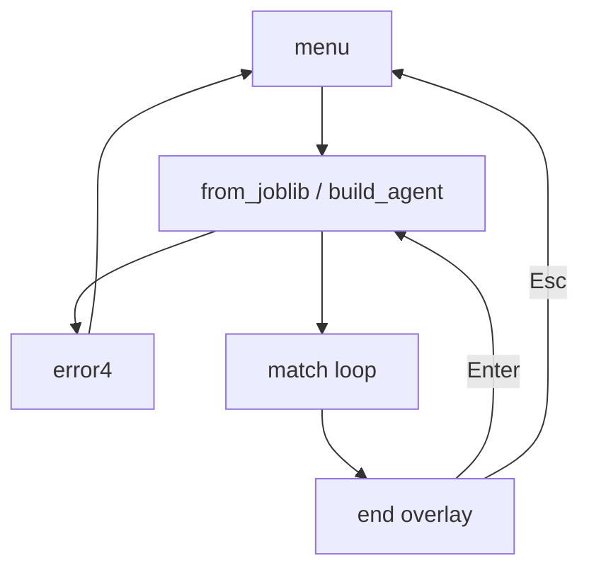

# U4 UI — Business Logic Model

## Frame

```text
poll pygame events
  map keys (BR-KEY-*)
if screen is match and not error:
  if paused and N pressed: state = tick(state, a, b); store TreeExplanation
  else if not paused:
    acc = min(acc + dt, 1/tick_rate)
    if acc >= 1/tick_rate:
      acc -= 1/tick_rate
      state = tick(state, a, b)
      store TreeExplanation from ActResult if present
      if terminal: screen = end overlay
draw 60 FPS
flip
```

Text alternative: events first, then at most one simulation tick (or one stepped tick while paused), then a full redraw. The accumulator never holds more than one tick period.

## Start match

```text
build AgentSpec(s) from PolicyId
try:
  agent_a, agent_b = build_agent(...)
except ModelLoadError as e:
  log e to stderr
  screen = error4(e.reason, path)
  return
state = new_match(CoreConfig(...), ui_match_seed(session, index))
screen = match
```

## Menu → play / spectator



Text alternative: the menu builds agents; a load failure is erro 4; a finished match overlays the board; Enter rebuilds agents with a new seed; Esc returns to the menu.

## Key map

| Physical | `Direction` |
| --- | --- |
| Up / W | N |
| Right / D | E |
| Down / S | S |
| Left / A | W |

## Outcome labels

Human vs. IA uses `outcome` with A = player: `win_a` → jogador, `win_b` → máquina, `draw` → empate.

Spectator uses the same `outcome` with policy labels for A/B.

## Propriedades testáveis (PBT-02/03/07/08/09)

| ID | Target | Property | Type |
| --- | --- | --- | --- |
| P-UI-MAP | `keys` | Arrow and WASD for the same compass point yield the same `Direction` | Invariant |
| P-UI-PAUSE | match | While paused, movement keys leave `state` and the human buffer unchanged | Invariant |
| P-UI-STEP | **N** | One **N** while paused equals one `MatchService.tick` | Oracle |
| P-UI-ACC | accumulator | After any `dt`, the stored acc is in `[0, 1/tick_rate]` and ticks this frame ∈ {0, 1} | Invariant |
| P-UI-FROZEN | `render` | `state` before draw equals `state` after draw | Invariant |
| P-UI-ERR | erro 4 | Every `ModelLoadError.reason` maps to exactly one PT body line; HUD/string contains no traceback | Oracle |
| P-UI-CFG | `config.yaml` | Known fields round-trip; unknown/invalid field → default + no crash | Round-trip |

Generators: legal `dt` values, pause flags, `PolicyId` pairs, `ModelLoadError` reasons. Tests live under `tests/ui/` (PBT-08).

## Judgement calls (veto at the gate)

| Call | Choice | Why |
| --- | --- | --- |
| `hud_width` default 280 | Fits labels at `cell_px=24` without a second config key if you prefer to fold it in | Q10 only named `cell_px` |
| Same-name spectator winner appends `(NO)`/`(SE)` | Otherwise "vitoria do Facil" is ambiguous | Q6 spectator wording |
| `ui_match_seed` in `core/rng.py` | D48: no new streams outside that module | Rematch must be deterministic |
| Erro 4 strings use the four `reason` keys only | Matches `ModelLoadError` | Q5 |
