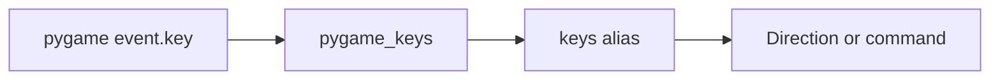

# U4 UI — Logical Components

No queues, caches-as-infra, or circuit breakers. The only "cache" is in-process pygame `Surface`s for HUD / stub text (D55 item 1).

## Components delivered by U4

| Component | Responsibility | Depends on | pygame? |
| --- | --- | --- | --- |
| `core/rng.py` | **Add** `ui_match_seed` (tag `6_000_003`) | numpy | no |
| `ui/config.py` | `--config` load, `safe_load`, per-field defaults, `models_dir`, optional `session_seed` | PyYAML, pathlib | no |
| `ui/keys.py` | Named aliases → `Direction` / command | `core.state` | no |
| `ui/clock.py` | Accumulator cap (`1/tick_rate`); ticks this frame ∈ {0, 1} | — | no |
| `ui/pygame_keys.py` | `K_*` → alias | pygame, `keys` | yes |
| `ui/fonts.py` | `importlib.resources` TTF + OFL file | stdlib, pygame.font | yes |
| `ui/render.py` | Board + cached HUD / stub surfaces | pygame, fonts | yes |
| `ui/screens.py` | Menu, match, erro 4, end overlay | services, agents, render | yes |
| `ui/app.py` | Screen stack, 60 FPS loop, `set_mode` | screens, clock | yes |
| `scripts/jogo.py` | `argparse --config`; `app.run` | `ui` | yes |
| `scripts/` FPS tool | 600-frame spectator Difícil vs Difícil, panel on | `ui` | yes |

`config.py` may parse argv if tests need it; `jogo.py` stays the player entry (`python scripts/jogo.py`).

## UiConfig fields added or revised by D55

| Field | Default / rule |
| --- | --- |
| `session_seed` | Optional. If the key is **absent**, `secrets.randbits(31)` at session start + stderr. If **present**, use the int (including `0`) |
| `models_dir` | `"models"`, resolved vs `Path(config_path).parent` |
| `cell_px` / `hud_width` / `tick_rate` / board / obstacles / `panel_key` | Unchanged from the Functional Design |

## Modified existing components

| Component | Change | Constraint |
| --- | --- | --- |
| `core/rng.py` | `ui_match_seed(session_seed, match_index) -> int` | Tag `6_000_003` only; same `integers` shape as `collection_seed` |
| `pyproject.toml` | extras `[ui]` and `dev` includes `[ui]`; coverage + mypy + package-data `ui/fonts` | Pins in Code Generation |
| `assets/fonts/` | Audit copies of TTF + OFL license | Must match package data |

## Font packaging

```text
src/snake_vs_machine/ui/fonts/   # runtime (importlib.resources)
assets/fonts/                    # same bytes, license audit
```

Text alternative: the installed package carries the font and license; the workspace `assets/fonts/` tree is the reviewable copy.

## Key path



Text alternative: pygame maps a `K_*` code to a name; `keys.py` maps the name to a `Direction` or a match command.

## Start-up

```text
parse --config
load YAML (or defaults)
if session_seed key absent: secrets.randbits(31); print on stderr
resolve models_dir vs config file parent
pygame.init + set_mode
  on fail: PT stderr + SDL line; exit 1
load font from package data
show menu
```

## FPS script path

```text
build hard vs hard (mask on)
panel_visible = true
run 600 frames with Clock.tick(60)
print mean FPS, min FPS
exit 0
```

Text alternative: the script is a thin driver over the same match loop; it does not use the dummy video driver.

## Resource profile

| Resource | Expectation |
| --- | --- |
| Memory | One window (~760×480), two snakes, a handful of cached text surfaces |
| CPU | One process; `act` of BC-8 + mask on the FPS path |
| I/O | Read `config.yaml`, joblib under `models_dir`, package fonts |
| GPU / vsync | Not used; software/SDL blit + `Clock.tick(60)` |

## Placement decisions

| Question | Decision | Reason |
| --- | --- | --- |
| Who maps `K_*`? | `pygame_keys.py`, not `keys.py` | D54 item 8 + D55 item 3 |
| Who draws pixels? | `render.py` (omitted from coverage) | D54 item 4 |
| Who owns the new stream? | `core/rng.py` only | D48 |
| Who bootstraps a missing session seed? | `ui/config` or `app` at session start — not `rng.py` | `secrets` is not a stream tag |
