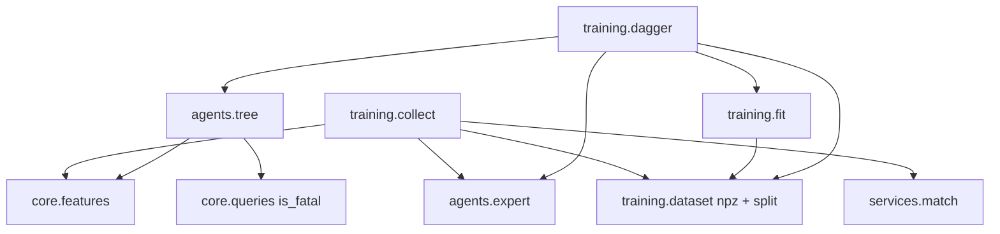

# U5 Behavior Cloning — Business Logic Model

## Module flow



Text alternative: collection plays matches and writes an `.npz`; fit reads the train split; DAgger lets the current tree play, labels those states with the expert, appends to train, and refits. `TreeAgent` only reads features and `is_fatal`.

## `from_joblib`

```text
json_path = path.with_suffix(".json")
if path missing or json_path missing → ModelLoadError(reason="missing")
meta = parse JSON into ModelMeta
if sklearn.__version__ != meta.sklearn_version → reason="sklearn"
if numpy.__version__ != meta.numpy_version → reason="numpy"
if meta.feature_schema_version != FEATURE_SCHEMA_VERSION
   or meta.feature_names != feature_names() → reason="schema"
tree = joblib.load(path)
return TreeAgent(tree, meta, safety_mask)
```

## `decide`

```text
ensure_playable(state, snake_id)
vector = extract_features(state, snake_id)          # 20-tuple
X = row of shape (1, 20)
raw = tree.predict_proba(X)[0]
proba = _map_proba(tree.classes_, raw)              # length 3, missing class = 0
proposed = _map_label(tree.predict(X)[0])
executed, vetoed = _apply_mask(state, snake_id, proposed, proba)
path = _path_steps(tree, vector)
return ActResult(executed, TreeExplanation(proposed, executed, vetoed, proba, path))
```

### `_map_proba`

```text
out = [0.0, 0.0, 0.0]
for p, cls in zip(raw, tree.classes_):
    out[_ACTIONS.index(cls)] = p
return tuple(out)
```

A tree trained without `turn_right` has `classes_ = [straight, turn_left]`; slot 2 stays 0. That is the mandatory fixture test (D50 item 7).

### `_apply_mask`

```text
if not safety_mask or not is_fatal(state, snake_id, proposed):
    return proposed, False
safe = [a for a in _ACTIONS if not is_fatal(state, snake_id, a)]
if not safe:
    return proposed, False
best = max(proba[i] for i, a in enumerate(_ACTIONS) if a in safe)
tied = [a for a in _ACTIONS if a in safe and proba[_ACTIONS.index(a)] == best]
if Action.straight in tied:
    return Action.straight, True
rng = agent_generator(state.seed, state.tick, snake_index(snake_id))
return tied[int(rng.integers(len(tied)))], True
```

`tied` has two turns when `straight` is absent; the draw is the only time this path builds a `Generator`.

### `_path_steps`

Walk `decision_path` node ids from the root. Skip the leaf (`tree_.feature[node] == -2`). For each internal node:

```text
name  = feature_names()[tree_.feature[node]]
thr   = tree_.threshold[node]
value = vector[tree_.feature[node]]
left  = value <= thr
```

Order is root first, last split last.

## Collection

```text
rows = []
match_id = 0
while len(rows) < 100_000:
    for pairing, spec_a, spec_b, keep, sides in (
        ("expert_vs_expert", expert, expert, {A, B}, default_or_swapped),
        ("expert_vs_random", expert_on_alternating_side, random, {expert_id}, alt_sides),
    ):
        seed = collection_seed(batch_seed, pairing, match_id)
        def on_tick(before, result_a, result_b, after):
            for snake_id in keep:
                rows.append(feature_row(before, snake_id, expert.act(before, snake_id),
                                       match_id, seed, before.tick, pairing, 0))
        play(spec_a, spec_b, config, seed, on_tick=on_tick)
        match_id += 1
write_npz(rows, metadata)
```

`keep` is the set of snakes whose **expert** label is stored. Expert vs random **alternates** `{A: NW, B: SE}` and `{A: SE, B: NW}` (D25); `keep` is whichever `SnakeId` the expert occupies, and `expert_side` is written on the row (D52 item 4).

Workers run under `evaluation.batch`'s `imap_unordered` pool and return the labelled rows for the driver to concatenate (D52 item 2).

## Split

```text
ids = sorted(unique(match_id))
cut = int(0.8 * len(ids))
train_ids = set(ids[:cut])
test_ids  = set(ids[cut:])
# write train.npz / test.npz; never write a test row again
```

## DAgger iteration `k` in 1..5 (D52 item 3)

```text
target = 0.20 * n_initial          # ~20 000 on the full 100 k set
for each product depth d in (3, 6, 8):
    student = TreeAgent.from the current d, safety_mask=False
    play student vs expert through evaluation.batch
    sides alternate by match index (D25)
    on_tick: label the student's pre-tick state with ExpertAgent.act
             pairing="dagger", dagger_iter=k
stop when the three students together produced `target` new rows
append all of them to the single train set
refit all three depths on that train
record accuracy_frozen[d] and score_vs_random[d] (N=100) for each d
```

Labels are the expert's action on each **student** state, not the action the student took.

## Fit identity

```text
t1 = DecisionTreeClassifier(..., random_state=R).fit(X, y)
t2 = DecisionTreeClassifier(..., random_state=R).fit(X, y)
export_text(t1) == export_text(t2)
# or joblib dumps compare equal
```

That is the mandatory determinism test (D50 item 4). `R` is the same integer stored in every product JSON.

## Propriedades Testáveis (PBT-01)

| ID | Target | Property | Type | Source |
| --- | --- | --- | --- | --- |
| P-TREE-ACTION | `TreeAgent` | `act` returns one of the three relative actions | Invariant | BR-TREE-1 |
| P-TREE-PURE | `TreeAgent` | Same `(state, snake_id)` → same `ActResult`, mask draws included | Determinism | D44 / BR-MASK-5 |
| P-TREE-FROZEN | `TreeAgent` | `state` is unchanged after `decide` | Invariant | U1 types |
| P-TREE-MASK-SAFE | mask on | If any action is non-fatal, `executed` is non-fatal | Invariant | BR-MASK-4 |
| P-TREE-MASK-KEEP | mask on | If every action is fatal, `executed is proposed` and `vetoed` is False | Invariant | BR-MASK-6 |
| P-TREE-VETO | mask on | `vetoed` ⇔ `executed is not proposed` | Invariant | BR-XPL-4 |
| P-TREE-PROBA | mapping | Missing `classes_` entry → slot 0; present slots sum to 1 | Oracle | BR-PROBA-2 |
| P-TREE-PATH | `path` | For every step, `went_left == (feature_value <= threshold)` and `feature_value` equals that slot of `extract_features` | Oracle | BR-XPL-3 |
| P-TREE-LOAD | `from_joblib` | Wrong sklearn / numpy / schema / missing file → `ModelLoadError` with the matching `reason` | Oracle | BR-TREE-5/6 |
| P-FIT-DET | `fit` | Two classifiers with the same `random_state` and `(X, y)` have identical trees | Determinism | BR-FIT-2 |
| P-SPL-DISJOINT | split | No `match_id` in both train and test | Invariant | BR-SPL-2 |
| P-DAG-FROZEN | DAgger | After any iteration the test `match_id` set is unchanged | Invariant | BR-SPL-3 |
| P-COL-EXPERT | collect | Every stored `y` equals `ExpertAgent.act` on that `(state, snake_id)` | Oracle | BR-COL-2 |

## Worked examples

### 1. Mask replaces a wall-bound `straight`

Snake A at `(19, 0)` facing east. `straight` and `turn_left` are out of the board; `turn_right` is in-bounds and empty. Tree proposes `straight` with proba `(0.50, 0.25, 0.25)`.

| Mask | `proposed` | `executed` | `vetoed` |
| --- | --- | --- | --- |
| off | `straight` | `straight` | False |
| on | `straight` | `turn_right` | True |

`turn_right` is the only safe action, so there is no tie and no RNG.

### 2. Mask tie broken by `straight`

Two safe actions, `straight` and `turn_left`, both mapped proba 0.4; `turn_right` is fatal. BR-MASK-5 picks `straight` without a draw.

### 3. Mask tie between the two turns

Only `turn_left` and `turn_right` are safe and they share the top proba. One `agent_generator(seed, tick, snake_index)` draw picks between them, `drawn` from the expert's point of view — here `vetoed` is True and `executed` is whichever index the stream yields. Replaying the same state repeats the pick.

### 4. Missing class

A fixture tree trained only on `straight` and `turn_left` has `classes_ = [straight, turn_left]`. Mapped `proba` is `(p0, p1, 0.0)`. `decide` still returns an `Action`. This is the D50 item 7 test, not a production model.

### 5. Full-buffer / explanation routing (already U3)

`MatchService` sees `decide`, calls it once, and forwards the `TreeExplanation` through `on_tick`. U5 adds no extra hook.

## Judgement calls you can veto at the gate

These are consequences of D50 that you did not spell out as numbered items:

| Call | Choice | Why |
| --- | --- | --- |
| Expert vs expert keeps **both** snakes | Both agents are the expert, so both labels are legal under Q3=A | Otherwise we throw away half of the cheapest samples |
| Split is sorted `match_id`, first 80% train | No new RNG, fully reproducible | A stream-based shuffle would need another tag |
| DAgger: three trees vs expert, sides alternate, one shared train, ~20 k rows/iter | D52 item 3 | — |
| Per-iteration vs-random uses **100** matches; acceptance uses **500** | The curve is 5 × 3 batteries; 500 each would dominate the pipeline | The 90% floor stays on the final 500 |
| Collection / DAgger tags `4_000_003` / `5_000_003` | Next free tags after the U3 helper and agent streams | Must live in `core/rng.py` (D48) |
