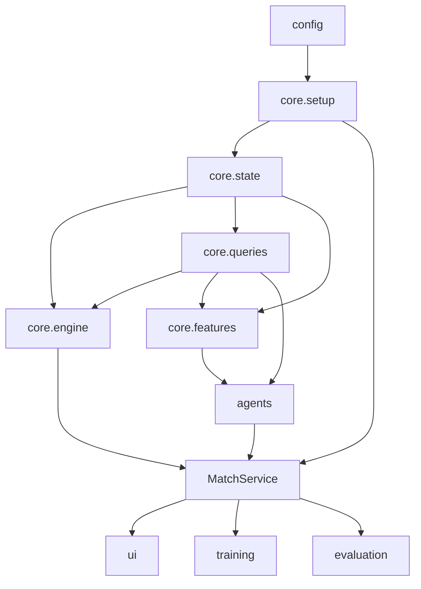

# Component Dependencies — Snake vs. Máquina

## Dependency matrix

| From \ To | state | setup | engine | queries | features | agents | match | config | training | evaluation | ui |
| --- | --- | --- | --- | --- | --- | --- | --- | --- | --- | --- | --- |
| setup | R | — | — | R | — | — | — | R | — | — | — |
| engine | R | — | — | R | — | — | — | — | — | — | — |
| queries | R | — | — | — | — | — | — | — | — | — | — |
| features | R | — | — | R | — | — | — | — | — | — | — |
| agents | R | — | — | R | R (tree/expert) | — | — | — | — | — | — |
| match | R | R | R | — | — | R | — | R | — | — | — |
| training | — | — | — | — | R | R | R | R | — | R | — |
| evaluation | — | — | — | — | — | R | R | R | — | — | — |
| ui | — | — | — | — | — | R | R | R | — | — | — |

`core` não depende de `ui` nem de `training`. **D32**: `engine.step` **depende** de `queries.next_occupancy` no passo 5.

## Data flow (one tick)

```
UI or headless decides WHEN
HumanAgent.push_absolute (async keys) optional
agent_a.act(state, A) --> action_a
agent_b.act(state, B) --> action_b
engine.step(state, action_a, action_b) --> state'
```

Tree `act` may call `is_fatal` / `predict_proba` and returns `ActResult` (action + ExplanationPayload). U7 does not recompute the tree path.



Text alternative:

```
config -> setup -> state
state -> engine, queries, features
queries -> engine (next_occupancy, D32), features, agents
MatchService (U3) uses agents + engine.step
UI and headless call MatchService; they own the clock
```

## Construction vs runtime
D27/D30: U5 before U4 is **risk order** (dashed); U4 compiles without U5. D28: MatchService is U3, so U4 and U5 both depend on U3.
