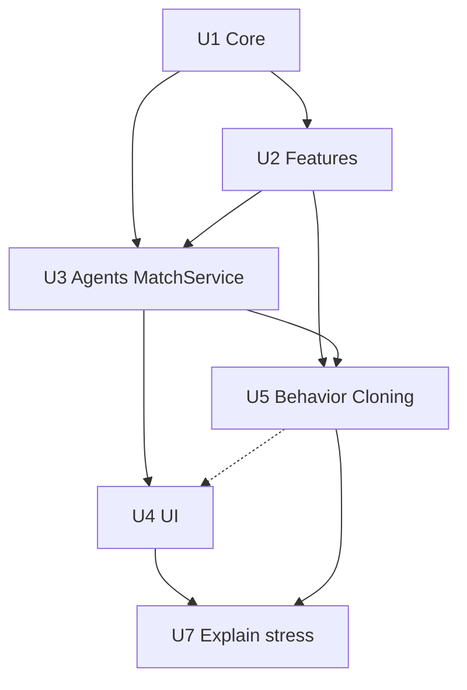

# Unit of Work Dependencies

Construction order (must-run sequence): **U1 → U2 → U3 → U5 → U4 → U7**.

## Matrix (runtime / data)

| Unit | Depends on | Why |
| --- | --- | --- |
| U1 | — | Núcleo |
| U2 | U1 | `flood_fill_count` / `reachable_cells`, `State` |
| U3 | U1, U2 | Expert/features; MatchService + `engine.step` |
| U5 | U2, U3 | Features + MatchService + expert; tree |
| U4 | U1, U3 | MatchService, HumanAgent, State; **não** U5 em compile-time (modelos .joblib em runtime) |
| U7 | U4, U5 | Painel na UI; torneio com árvores treinadas |
| U6 | — | Deferred |

U4 after U5 is **construction risk order only** (D27/D30): dashed on the diagram; U4 compiles without U5.



Text alternative:

```
U1 -> U2 -> U3 -> U5
U3 -> U4
U5 -. risk order .-> U4
U4 -> U7
U5 -> U7
```
