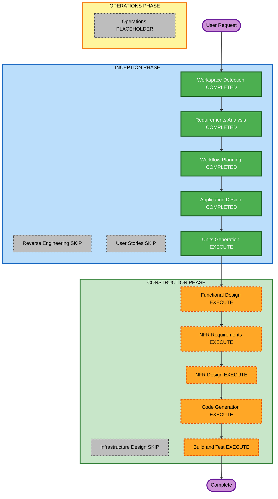

# Execution Plan

## Detailed Analysis Summary

### Change Impact Assessment
- **User-facing changes**: Yes — Pygame (menu, partida, HUD, painel, espectador)
- **Structural changes**: Yes — greenfield: core, agents, training, evaluation, ui
- **Data model changes**: Yes — `State`, cobras, comida, obstáculos, ticks
- **API changes**: Yes — `Agent.act(state) -> action` (in-process, not HTTP)
- **NFR impact**: Yes — 60 FPS, inferência < 1 ms, throughput headless, PBT parcial, reprodutibilidade

### Risk Assessment
- **Risk Level**: Medium (treino BC e aceite D12/40%; núcleo de regras é alto rigor, baixo risco de produto)
- **Rollback Complexity**: Easy (sem produção)
- **Testing Complexity**: Complex (regras 1–10, PBT, torneios 500)

## Workflow Visualization



Text alternative:

```
INCEPTION: WD completed, RE skip, RA completed, US skip,
WP completed, AD completed, UG completed (D30)
CONSTRUCTION: FD in progress U1 (questions); NFR req+design execute U1-U4 only (skip U5/U7);
Infra skip; CG pending orange; BT pending orange
OPERATIONS: placeholder
```

## Phases to Execute

### INCEPTION PHASE
- [x] Workspace Detection (COMPLETED)
- [x] Reverse Engineering (SKIPPED — greenfield)
- [x] Requirements Analysis (COMPLETED — D01–D30)
- [x] User Stories (SKIPPED — usuário pediu Units Generation / Application Design)
- [x] Execution Plan (APPROVED — D27)
- [x] Application Design - COMPLETED (D29)
- [x] Units Generation - COMPLETED (D30)
  - **Rationale**: U1–U5 e U7; U6 fora; mapa RF→unit; ordem D27; aceites/DoD D30

### CONSTRUCTION PHASE
- [ ] Functional Design - EXECUTE (todas as units desta versão)
  - **Rationale**: Regras 1–10, D14, D24, D26, features, BC
- [ ] NFR Requirements - EXECUTE só U1, U2, U3, U4; SKIP U5 e U7
  - **Rationale**: D27 — NFRs de U5/U7 já são métricas de aceite em requirements.md
- [ ] NFR Design - EXECUTE só U1, U2, U3, U4; SKIP U5 e U7
  - **Rationale**: Segue NFR Requirements (D27)
- [ ] Infrastructure Design - SKIP
  - **Rationale**: App desktop local; sem nuvem nesta versão
- [ ] Code Generation - EXECUTE (ALWAYS, pendente — laranja no diagrama)
- [ ] Build and Test - EXECUTE (ALWAYS, pendente — laranja no diagrama)

### OPERATIONS PHASE
- [ ] Operations - PLACEHOLDER

## Construction unit order
U1 -> U2 -> U3 -> U5 -> U4 -> U7 (U6 deferred). D27: U5 antes de U4 (maior risco; não depende da UI).

## Success Criteria
- **Primary Goal**: Jogo humano vs. árvore explicável + BC-3/6/8 + torneio/estresse
- **Key Deliverables**: `src/snake_vs_machine/`, `pyproject.toml`, testes, `models/bc_depth{3,6,8}.joblib`, `reports/stress_results.md`
- **Quality Gates**: aceite por unit; taxa 1/0,5/0; PBT-02/03/07/08/09 no recorte parcial; alerta D12 em U5 (100 partidas) + aceite U7 (500)

## Notes
- Histórias: puladas; mapeamento de units usa RFs e decisões no lugar de `stories.md`.
- D27: ordem U1-U2-U3-U5-U4-U7; NFR só U1–U4; alerta D12 na U5; CG/BT pendentes no diagrama.
