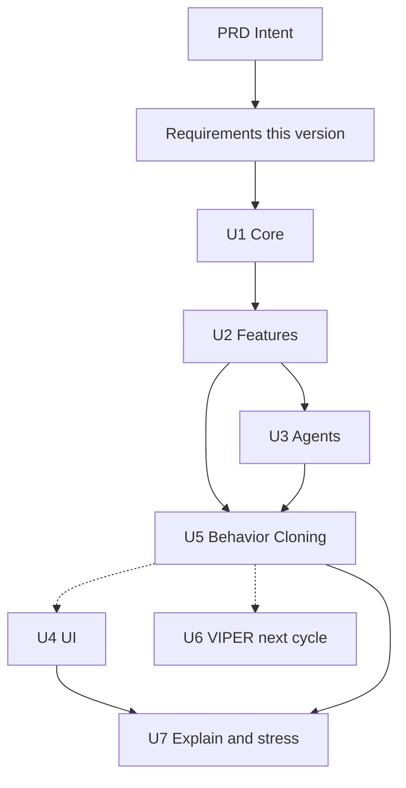

# Requirements — Snake vs. Máquina

## Intent Analysis Summary

- **User request**: Iniciar o AI-DLC com o PRD Snake vs. Máquina (IA com árvore de decisão).
- **Request type**: New project (greenfield)
- **Scope**: System-wide (núcleo do jogo, agentes, treino BC, UI Pygame, torneio, estresse)
- **Complexity**: Complex
- **Requirements depth**: Comprehensive
- **Source**: `PRD/PRD — Snake vs. Máquina (IA com Árvore de Decisão) · AI-DLC.md`
- **Workspace**: Greenfield — sem código da aplicação; PRD + regras AI-DLC + `.venv`
- **Revision**: 2026-09-28 — revisões 1–2 incorporadas; **aprovado** após D22–D25. Detalhe em `aidlc-docs/decisions.md`.

## Key Requirements Summary

- Jogo Snake desktop em Python: humano vs. IA no **mesmo tabuleiro 20x20**, mesma comida.
- Controle humano **absoluto** na tela; `HumanAgent` converte para ação relativa e ignora marcha à ré.
- Partida com **1800 ticks fixos**; `tick_rate` só define a velocidade de exibição.
- IA explicável: árvore de decisão com painel da regra; o painel indica se a máscara vetou a ação.
- Esta versão: Units **U1–U5 e U7**. **U6 VIPER / PPO fora**.
- Três dificuldades Must: Fácil BC-3, Médio BC-6, Difícil BC-8 com `safety_mask` ligada (aceite: +10 pp vs. Médio contra o especialista).
- RF07 espectador = Should. RF08 fora do MVP.
- UI em português (incluindo dicionário de rótulos das features); identificadores de código em inglês.
- Taxa de vitória pontuada: vitória=1, empate=0,5, derrota=0; taxa de empates reportada à parte.
- U1: obstáculos internos por seed (padrão 0); `space_free_*` normalizado por `min(200, células livres)`.
- Extensões: Security off, Resiliency off, PBT parcial (inclui rotação e espelhamento de `extract_features`).

## Decisions Captured

| ID | Decisão | Origem |
| --- | --- | --- |
| D01 | Disputa no mesmo tabuleiro, duas cobras, uma comida | Q1=A |
| D02 | Painel RF05 sempre visível, tecla para ocultar/mostrar (padrão `H`) | Q2=C |
| D03 | RF08 fora do MVP | Q3=A |
| D04 | Escopo: U1–U5 + U7 completa; U6 no próximo ciclo | Q4=X |
| D05 | Modo espectador IA vs. IA com Pygame incluso | Q5=B |
| D06 | Interface em português; nomes de código em inglês | Q6=C |
| D07 | `tick_rate` padrão 10 só para exibição; partida sempre 1800 ticks; render 60 FPS | Q7=X + revisão |
| D08 | Sem treino PPO nesta versão | Q8=C |
| D09 | Security Baseline desligado | Q9=B |
| D10 | Resiliency Baseline desligado | Q10=B |
| D11 | PBT parcial (PBT-02, PBT-03, PBT-07, PBT-08, PBT-09 bloqueantes) | Q11=B |
| D12 | Difícil = BC-8 + `safety_mask` on; aceite ≥ 10 pp de vitória a mais que Médio vs. especialista; meta 40% para BC-8 com máscara; VIPER no próximo ciclo só se superar esse Difícil | Clarification Q1=X + revisão |
| D13 | Teclas humanas absolutas; `HumanAgent` converte para relativa e descarta ré | Revisão 1 |
| D14 | Cruza cabeças = head-to-head; ambas morrem no mesmo tick = empate; cauda que sai no tick é livre, exceto se a cobra comeu | Revisão 2 |
| D15 | RF05 mostra quando a máscara vetou a ação da árvore | Revisão 4 |
| D16 | Acurácia ≥ 95% só BC-6 e BC-8; BC-3 sem meta de acurácia | Revisão 5 |
| D17 | RNF03: 1000 partidas/min em random vs. random; vs. especialista medir/registrar; multiprocessing permitido | Revisão 6 |
| D18 | U7: dicionário PT de rótulos de features no painel | Revisão 7 |
| D19 | PBT: invariância à rotação e ao espelhamento em `extract_features` | Revisão 8 |
| D20 | RF07 = Should | Revisão 9 |
| D21 | Conjunto de teste do BC congelado antes do DAgger; grade de `max_depth` só experimental; modelos entregues = 3, 6, 8 | Revisão 9 |
| D22 | Taxa de vitória: 1 / 0,5 / 0; reportar empates à parte | Revisão 2 |
| D23 | Obstáculos internos no U1 (seed; padrão 0); perigo em features, flood fill, especialista e máscara | Revisão 2 |
| D24 | `safety_mask` só mortes determinísticas; veto → maior `predict_proba` segura; se todas fatais, ação original | Revisão 2 |
| D25 | `space_free_*` / `min(200, livres)`; torneios alternam NW/SE; spawns fixos | Revisão 2 |
| D26 | Comida inicial `(10, 9)`; obstáculos: zona r=2, simetria 180°, count par, flood fill + seed derivada | Fechamento Inception |
| D27 | Ordem U1-U2-U3-U5-U4-U7; alerta D12 na U5 (100); NFR só U1–U4; CG/BT pendentes no diagrama | Execution plan |
| D28 | core.setup; MatchService na U3; is_fatal/flood_fill; buffer humano 2; pacote src/snake_vs_machine + pyproject; sklearn pinado | Application Design |
| D29 | D26c: um componente com TODAS as livres; is_fatal cauda oponente conservadora | Application Design |
| D30 | Aceites U1/U3/U5/U7; DoD `uN-done`; U5→U4 tracejada; TreeAgent devolve ExplanationPayload | Units Generation |
| D31 | Respawn uniforme; H2H na comida; `step` puro; `death_cause` vs `end_reason`; PBT 3 ações; cobertura U1/U2 | Functional Design U1 |
| D32 | Cabeça oponente: H2H só na troca; `is_fatal` fatal; `next_occupancy`; `flood_fill_*`; P-ENG-NOOVERLAP | Functional Design U1 |
| D33 | `next_occupancy` real vs D29; `step` passa ação do oponente; P-OCC-CONSERV; teste cauda | Functional Design U1 |
| D34 | numpy pin NEP 19; Hypothesis dev/full; frozen types; cov-branch 80%; bench informativo; mypy opcional | NFR Requirements U1 |
| D35 | `snake_a`/`snake_b` + `side_a`/`side_b`; sem dict/list/set internos; `hash(state)` + FrozenInstanceError | NFR Design U1 |
| D36 | TDD antes do engine; PBT via `new_match`+`step`; replay; `fail_under=80` | Code Generation U1 |
| D37 | Python ≥ 3.13; ruff `py313`; mypy 3.13 | Code Generation U1 |
| D38 | Features: geometria PBT no tabuleiro; consistência danger/dist/space; `FEATURE_SCHEMA_VERSION`; ValueError se morto/terminal | Functional Design U2 |
| D39 | `flood_fill_count` isométrico; golden vector kickoff A; justiça A==B; worked example 1 substituído | Functional Design U2 |
| D40 | U5 < 1 ms inclui features+proba+máscara; U2 ≤ 0,5 ms informativo com ALERTA; flood compartilhado só se alerta | NFR Requirements U2 |
| D41 | CG U2: testes dos helpers de transform; commit U1 D39 antes da Etapa 1 | Code Generation U2 |
| D42 | `free_cells` aritmético uma vez por chamada; PBT de oráculo; bench 4,11 → 2,12 ms (ainda ALERTA) | Revisão de código U2 |
| D43 | BFS por índices inteiros; `danger` por `_blocked` + PBT contra `is_fatal`; bench 2,12 → 0,415 ms (OK); passo 3 dispensado | Revisão de código U2 |
| D44 | U3: especialista sem A\* (BFS + ordem de decisão), RNG por tick, `HumanAgent` filtra no push, `MatchResult` + `on_tick`, pacote `services/` | Functional Design U3 |
| D45 | `ExplainingAgent.decide` → `ActResult` repassado pelo `on_tick`; buffer cheio ignora a tecla nova; sincronização de `components.md` / `component-methods.md` | Revisão do FD U3 |
| D46 | RNF03 por multiprocessing + ticks/s; especialista ≤ 1 ms com ALERTA e BFS único da comida; cobertura/mypy em `agents`+`services`; `TypeError` no contrato; `max_ticks` 60 no PBT; `scripts/` | NFR Requirements U3 |
| D48 | `Pool.imap_unordered` com specs de agente; `core/rng.py` como registro único de streams; paridade sequencial/paralelo em 20 seeds; duas linhas de bench do especialista; `evaluation/scoring.py` | NFR Design U3 |
| D49 | Cobertura e mypy incluem `evaluation`; P-EXP-MIRROR (espelho troca left/right); golden do especialista com distâncias 14/16/14 | Code Generation U3 |
| D50 | U5: defaults gini/leaf=1; DAgger 5 com curva; `.npz` rico; `random_state` fixo; máscara straight-ou-sorteio; `TreeExplanation`+proba+path; `classes_`; pin sklearn na CG | Functional Design U5 |
| D51 | `scikit-learn==1.9.1`, `joblib==1.6.0` (compatível com `numpy==2.2.6`) | Code Generation U5 |
| D52 | U5 fecha com modelos reais; sonda 5% + MP do batch; DAgger três árvores vs especialista, +20 k/iter; expert vs random alterna NW/SE | Code Generation U5 |
| D53 | U4: layout A; WASD+setas; Esc/P/N/R; espectador qualquer par; erro 4 + stderr; overlay Enter/Esc; stub RF05; 1 tick/frame; pygame pin na CG; cell_px=24 | Functional Design U4 |
| D54 | FPS script janela real + ALERTA <55; pygame+pyyaml extra [ui] (dev inclui); mypy ui + stubs pygame; cov ui omit render.py; TTF OFL em assets/fonts/; --config; sem vsync | NFR Requirements U4 |
| D55 | FPS 600 frames Difícil+painel + cache de texto; fonte via importlib.resources; keys por apelido; tag 6_000_003; session_seed opcional/secrets; models_dir; display fail PT+SDL | NFR Design U4 |
| D56 | SeedSequence: zeros finais invisíveis; tags distintas + tetos; novos streams tag na 2ª posição; `ui_match_seed` 6_000_003 | Code Generation U4 |
| D57 | `pygame==2.6.1`, `PyYAML==6.0.3` no extra `[ui]`; stubs do pygame reconhecidos pelo mypy | Code Generation U4 |
| D58 | `ui/session.py` puro + TDD; P-UI-PAUSE/STEP sem pygame; app/screens finos; session na cobertura | Code Generation U4 |
| D59 | U7: diagnóstico morte+críticos; ruído A+[0,1]+sem length_diff+tag 8e6+3; painel 3 last+valor; labels_pt.py; IC normal+Δ D12; tags 7e6+3/8e6+3 | Functional Design U7 |
| D60 | U7 CG: seeds pareadas sem pairing_code; `paired_difference_ci`; ruído N=200 (N<200 indicativo); Pool Windows hang + RNF03 herdado da U3 | Code Generation U7 |

Registro completo: `aidlc-docs/decisions.md`.

## Scope of This Version

**In scope**

- Regras do jogo (incluindo cruza-cabeças, empate por morte simultânea, regra da cauda, obstáculos internos)
- Features, agentes (humano absoluto→relativo, aleatório, especialista, árvore)
- UI Pygame: menu, HUD, partida humano vs. máquina, modo espectador
- Behavior Cloning + DAgger; modelos **entregues** `bc_depth3.joblib`, `bc_depth6.joblib`, `bc_depth8.joblib`
- Painel de explicação (rótulos PT + veto da máscara), torneio headless, testes de estresse e `reports/stress_results.md`

**Out of scope (this version)**

- U6: Gymnasium `SnakeVersusEnv`, PPO, VIPER, `viper.joblib`
- RF08 gravação/treino no estilo do jogador
- Multiplayer em rede, mobile, web, gráficos elaborados, sons, skins
- Rede neural como produto final
- Escolher profundidade pelo vencedor da grade 3–12 (a grade não gera o artefato de produto)

**Next cycle (documented, not built now)**

- VIPER substitui Difícil se a taxa de vitória vs. especialista for maior que a da BC-8 com máscara (já sujeita ao aceite D12 vs. Médio).

## Game Rules (Must)

Tabuleiro padrão 20x20. Duas cobras no mesmo grid. Uma comida. Ticks simultâneos.

1. Cada cobra começa com 3 segmentos, cantos opostos, direção para o centro.
2. Sempre 1 comida; comer cresce 1 segmento e respawna em célula livre. Kickoff: D26. Meio da partida: uniforme entre livres com `SeedSequence([seed, tick])` (D31). Duas cabeças na comida: H2H primeiro (D31).
3. Morte: parede, **obstáculo interno**, próprio corpo, corpo da adversária.
4. Cabeça com cabeça: morre a menor; mesmo tamanho = empate.
5. Fim: morte de uma cobra **ou** atingir **1800 ticks**. No limite de ticks, vence a maior (empate se iguais).
6. As duas cobras movem no mesmo tick.
7. **Troca de posição das cabeças** (A vai para a célula de B e B vai para a célula de A no mesmo tick) conta como colisão cabeça com cabeça (regra 4).
8. **Ambas morrem no mesmo tick** = empate, independentemente da causa de cada morte.
9. **Seguir a cauda**: entrar na célula que a cauda de qualquer cobra libera **no mesmo tick** é permitido, **exceto** se aquela cobra **acabou de comer** neste tick (a cauda não libera célula).
10. **Obstáculos internos**: lista de células bloqueadas (D23 + **D26**). Sólidos como parede. **Padrão: 0**. Geração: zona livre, simetria 180°, `obstacle_count` par, conectividade; ver seção U1 abaixo.

O limite de 1800 ticks é **independente** de `tick_rate`. `tick_rate` só controla quantos ticks a UI aplica por segundo de relógio.

### Starting positions (U1)

Sistema de coordenadas: origem `(0, 0)` no **canto superior esquerdo**; `x` cresce à direita; `y` cresce para baixo. Tabuleiro padrão `width = height = 20` (células `0..19`).

Dois lados, cobras de 3 segmentos, direção para o centro:

| Lado | Head | Body (em direção à cauda) | Direction |
| --- | --- | --- | --- |
| **NW** | `(2, 2)` | `(1, 2)`, `(0, 2)` | East `(+1, 0)` |
| **SE** | `(17, 17)` | `(18, 17)`, `(19, 17)` | West `(-1, 0)` |

Comida inicial (**D26**): Manhattan 15 a cada cabeça — `(10, 9)`, não `(10, 10)` (este último favorece SE em 2 passos). Varredura em ordem de linhas `y`, depois `x`, **começando em `(10, 9)`**, percorrendo o restante do tabuleiro e voltando ao início até fechar o ciclo; primeira célula livre (não corpo, não cabeça, não obstáculo).

**Humano vs. máquina / espectador padrão:** humano (ou agente da esquerda no HUD) no NW; máquina no SE.

**Torneios e estresse:** os lados **alternam a cada partida**. Índice `i` (0-based): par → agente A no NW e B no SE; ímpar → A no SE e B no NW. A seed da partida não troca essa regra de lados.

### U1 design — obstacles (D26)

Geração determinística a partir de `seed` e `obstacle_count` (default 0). Se `obstacle_count == 0`, lista vazia.

1. **Paridade**: usar `n = obstacle_count` se par, senão `n = obstacle_count + 1`.
2. **Zona livre (Chebyshev, raio 2)**: nenhuma obstáculo em células com `max(|dx|, |dy|) <= 2` em torno de cada **cabeça** e da **célula imediatamente à frente** (NW frente `(3, 2)`; SE frente `(16, 17)`). Também proibidos: corpos iniciais e a célula da comida inicial.
3. **Simetria 180°**: se `(x, y)` é obstáculo, `(W-1-x, H-1-y)` também é. Pares colocados juntos; em 20×20 não há ponto fixo da rotação.
4. **Conectividade (D26c / D29)**: flood fill 4-conectado nas células **livres** (não obstáculo, dentro do tabuleiro; corpos iniciais não são “livres”). **Todas** as células livres DEVEM formar **um único** componente 4-conectado (não basta ligar cabeças e comida). Motivo: a comida renasce em qualquer livre e não pode cair num bolsão inalcançável. Se falhar, regenerar com `seed_k = seed + k * 1000003`. Após 100 tentativas, erro explícito.

Obstáculos entram em perigo/features, flood fill de `space_free_*`, A* do especialista e `safety_mask` (D23).

## Functional Requirements

| ID | Requirement | Priority | Acceptance |
| --- | --- | --- | --- |
| RF01 | Humano usa teclas **absolutas**. `HumanAgent` mantém buffer FIFO de até **2** comandos e **consome 1 por tick**; converte para ação relativa e **ignora marcha à ré**. Sem comando na fila → `straight`. | Must | Buffer 2; 1 por tick; ré ignorada; testes de fila |
| RF02 | Cobra da máquina carrega modelo `.joblib` conforme dificuldade; JSON irmão com versão pinada do scikit-learn | Must | Troca de arquivo no menu altera a política; versão incompatível = erro 4 |
| RF03 | Três dificuldades: Fácil `bc_depth3` (máscara off); Médio `bc_depth6` (máscara off); Difícil `bc_depth8` (máscara on) | Must | Menu lista as três; cada uma carrega o modelo e a flag corretos |
| RF04 | HUD: placar, tamanho das cobras, ticks restantes (de 1800) | Must | Valores atualizam a cada tick; texto em português |
| RF05 | Painel "Por que a IA fez isso?" com a regra do último movimento (`decision_path`, no máximo 3 condições próximas da folha), rótulos PT do dicionário U7, e indicação **quando a máscara vetou** a ação bruta da árvore (ação proposta vs. ação executada) | Should | Painel visível por padrão; `H` oculta/mostra; veto visível quando ocorrer |
| RF06 | Modo IA vs. IA sem GUI para torneios e coleta | Must | CLI/script roda N partidas com seed e grava resultados |
| RF07 | Modo espectador: IA vs. IA com Pygame | Should | Menu oferece espectador; sem input de movimento do humano |
| RF08 | Gravação estado→ação do humano para treinar estilo do jogador | Could | **Fora do MVP** |
| RF09 | Menu inicial: dificuldade e modo (humano vs. IA, espectador, sair) | Should | Textos em português; seleção antes da partida |
| RF10 | `config.yaml`: tamanho do tabuleiro, `tick_rate` (só exibição), tecla do painel, seed, `obstacle_count` (padrão 0). **Não** altera o limite de 1800 ticks | Should | Defaults: 20x20, `tick_rate` 10, tecla H, 0 obstáculos; UI a 60 FPS; partida sempre 1800 ticks |

### Modes

| Mode | Players | UI |
| --- | --- | --- |
| Humano vs. Máquina | Humano + árvore da dificuldade | Pygame + HUD + painel |
| Espectador | Árvore vs. árvore (ou árvore vs. especialista, configurável) | Pygame |
| Torneio / coleta | Agentes sem humano | Headless |

### AI Specification (this version)

- Classificador: `DecisionTreeClassifier` (scikit-learn).
- Ações da política: `straight`, `turn_left`, `turn_right` (código em inglês).
- Features: vetor único via `extract_features(state, snake_id)` (treino e jogo). Lista do PRD (20 features). Obstáculos internos entram em `danger_*`, `dist_danger_*` e no flood fill de `space_free_*`.
- `space_free_{ahead,left,right}`: células alcançáveis por flood fill após o movimento, **dividido por `min(200, free_cells)`**, onde `free_cells` é o número de células não ocupadas por parede de borda, corpos nem obstáculos. O valor é saturado em `[0, 1]`. **1,0 = espaço suficiente** em qualquer tamanho de mapa (alinha ao limite de busca 200).
- Especialista: A* até a comida (corpos, **obstáculos internos** e possíveis próximas cabeças como bloqueios); aceita passo só se flood fill > tamanho; senão máximo espaço livre.
- Behavior Cloning:
  - ≥ 100 mil amostras (especialista vs. especialista e vs. aleatório).
  - Split 80/20 **por partida**.
  - **Conjunto de teste congelado antes do DAgger**: DAgger agrega só ao treino; o teste não recebe estados novos.
  - Busca em grade sobre `max_depth` (3 a 12), `min_samples_leaf` (1 a 50) e `criterion` (gini, entropy) é **só para experimentos** (relatórios / estresse de profundidade).
  - **Modelos de produto entregues**: exatamente profundidades **3, 6 e 8** (`bc_depth3`, `bc_depth6`, `bc_depth8`), com `class_weight="balanced"`.
  - DAgger 3–5 iterações sobre essas profundidades de produto (não sobre o vencedor da grade).
- Artefatos: os três `.joblib` + JSON de métricas/hiperparâmetros/seed (RNF06), incluindo acurácia no teste congelado para BC-6 e BC-8.
- `safety_mask`: default **off**; **on** na dificuldade Difícil.
  - **Morte imediata** (única coisa vetada) = mortes **determinísticas** neste tick: parede, corpos, obstáculos internos, **respeitando a regra da cauda D14c**. Possíveis colisões de cabeça (incluindo troca de cabeças) **não** são vetadas.
  - Se a ação da árvore for vetada: executar a ação **segura** com maior `predict_proba`.
  - Se **todas** as três ações forem fatais no sentido determinístico: **manter a ação original** da árvore.
  - O painel RF05 registra o veto. Estresse compara on/off.

### Stress and tournament (U7)

- **Pontuação de taxa de vitória** (todas as metas de “vitória”, inclusive D12 e vs. aleatório/especialista): por partida, vitória = **1**, empate = **0,5**, derrota = **0**. Taxa = média dessas pontuações. **Taxa de empates** (`draws / N`) é reportada **separadamente**, não substitui a taxa de vitória.
- Torneio: seeds fixas; **alternância de lados** (D25); métricas por partida (vencedor, empate, ticks, comidas, causa da morte, tempo médio de inferência).
- Estresse: 500 partidas por nível vs. especialista; comparar **BC-3, BC-6, BC-8** e o especialista como referência (sem VIPER).
- Testes: profundidade (experimentos da grade, não substituem os três modelos de produto), ruído, sticky, atraso, tamanho de mapa, obstáculos, feature removida, poucos dados, máscara on/off.
- Painel: dicionário de rótulos em português para cada nome de feature (`danger_ahead` → texto PT, etc.), usado só na UI; código permanece em inglês.
- Throughput: registrar partidas/min (ver RNF03).
- Saída: `reports/stress_results.md` com gráfico de taxa de vitória + IC 95% e tabela de causas de morte.

### Metrics (MVP ready)

| Goal | Metric | Target |
| --- | --- | --- |
| IA competitiva | Taxa vs. aleatório (1 / 0,5 / 0) | ≥ 90% em 500 partidas (BC-6 e BC-8); reportar % empates |
| IA competitiva | Taxa vs. especialista (BC-8, máscara on) | ≥ 40% em 500; reportar % empates |
| IA competitiva | Aceite D12 Difícil vs. Médio | BC-8 (máscara on) ≥ Médio (BC-6, máscara off) **+ 10 pontos percentuais** na taxa 1/0,5/0 vs. especialista, mesma bateria de 500 |
| Fidelidade | Acurácia vs. especialista no **teste congelado** | ≥ 95% para **BC-6 e BC-8**; **BC-3 sem meta de acurácia** |
| Explicável | Profundidade dos modelos entregues | 3, 6 e 8 (máximo 8) |
| Desempenho | Inferência | < 1 ms/jogada **incluindo** `extract_features` + `predict_proba` + `safety_mask` (D40) |
| Desempenho | UI | 60 FPS estáveis |
| Robustez | Queda com 10% ruído nas features | ≤ 15 pp |
| Qualidade | Cobertura `core/` | ≥ 80% |
| Especialista | Taxa vs. aleatório (1 / 0,5 / 0) | ≥ 95% em 500 (aceite U3); reportar % empates |
| Headless | Throughput random vs. random | ≥ 1000 partidas/min (RNF03) |
| Headless | Throughput vs. especialista | Medir e registrar; sem meta mínima; multiprocessing permitido |

## Non-Functional Requirements

| ID | Requirement |
| --- | --- |
| RNF01 | Python 3.11+; Windows, Linux, macOS |
| RNF02 | Inferência < 1 ms/jogada **com máscara** = `extract_features` + `predict_proba` + `safety_mask` (D40); Pygame 60 FPS; `tick_rate` padrão 10 **só na exibição**; simulação headless pode avançar ticks sem esperar o relógio |
| RNF03 | Headless: ≥ 1000 partidas/min em **random vs. random**. Com o **especialista**, medir e registrar o throughput (sem piso). Multiprocessing permitido nos dois casos |
| RNF04 | Toda partida e treino aceitam `seed` e registram a seed |
| RNF05 | Type hints; `ruff`; `pytest`; PBT com `hypothesis` no recorte parcial |
| RNF06 | Modelos em `models/` com JSON irmão (dados, hiperparâmetros, métricas, seed, acurácia no teste congelado quando aplicável, **versão do scikit-learn**) |
| RNF07 | Núcleo (`core/`) sem dependência de Pygame |
| RNF08 | Identificadores de código em inglês; strings de UI e rótulos de features do painel em português |
| RNF09 | Flood fill limitado a 200 células (risco de FPS em mapas grandes) |
| RNF10 | Reprodutibilidade de features: mesma entrada → mesma saída em treino e jogo |
| RNF11 | Duração lógica da partida = 1800 ticks em todos os modos |

### Stack (this version)

`pygame`, `numpy`, `scikit-learn` (**versão pinada** no `pyproject.toml`), `joblib`, `pytest`, `hypothesis`, `matplotlib`, `pyyaml`, `ruff`

**Not in this version:** `gymnasium`, `stable-baselines3`

### Target structure

```
<workspace-root>/
├── aidlc-docs/
├── pyproject.toml
├── config.yaml
├── src/snake_vs_machine/
│   ├── core/          # state, setup, engine, queries, features
│   ├── agents/
│   ├── training/
│   ├── evaluation/
│   └── ui/
├── models/
├── data/
├── reports/
└── tests/
```

Instalação: `pip install -e .`. `training/env_gym.py` e VIPER não entram nesta versão.

## PBT Requirements (partial mode)

Aplicar com `hypothesis` em funções puras e round-trips (bloqueante: PBT-02, PBT-03, PBT-07, PBT-08, PBT-09).

| Area | Property | Category |
| --- | --- | --- |
| `extract_features` | Determinismo: mesmo estado+id → mesmo vetor | Invariant |
| `extract_features` | Binárias em {0,1}; distâncias e `space_free_*` em [0, 1]; `diff_tamanho` inteiro | Invariant (range) |
| `extract_features` | **Invariância à rotação**: rotacionar o tabuleiro 90/180/270° (cobras, comida, obstáculos, direção da cabeça) produz o **mesmo** vetor de features para o mesmo `snake_id` | Invariant |
| `extract_features` | **Invariância ao espelhamento**: refletir o tabuleiro no eixo à frente da cabeça troca features esquerda ↔ direita e preserva frente/trás e grandezas não laterais | Invariant |
| Estado serializado (se houver copy/snapshot) | round-trip igualdade estrutural | Round-trip |
| `config.yaml` load/dump | round-trip de campos conhecidos | Round-trip |
| Tick do motor | invariantes de regra (1 comida; tamanhos ≥ 0; no máximo um vencedor ou empate; regras 7–10; obstáculos sólidos) | Business invariant |
| `is_fatal` | Se False, `step` vs **3** ações do oponente **não** mata por parede/obstáculo/corpo em **qualquer** célula (D32); H2H não viola; cauda D29 | Invariant / oracle vs `engine.step` |

Geradores de domínio (PBT-07): tabuleiros legais, cobras válidas, seeds. PBT-08: testes no mesmo pacote que o código sob teste. PBT-09: falhas documentadas com entrada mínima.

PBT-01, PBT-04, PBT-05, PBT-06: consultivos neste projeto (modo parcial).

## User Scenarios

1. **Jogador casual**: abre o menu, escolhe Médio, usa setas/WASD em direção absoluta na tela, lê o painel (incluindo veto da máscara no Difícil), oculta com `H`, termina por morte ou aos 1800 ticks.
2. **Espectador**: escolhe espectador e vê duas IAs no Pygame.
3. **Desenvolvedor**: roda torneio headless e estresse; lê `reports/stress_results.md` e throughputs.
4. **Erro**: modelo `.joblib` ausente **ou** versão do scikit-learn diferente da gravada no JSON → mensagem em português e retorno ao menu, sem traceback cru no HUD (erro 4).
5. **Erro**: `config.yaml` inválido → defaults documentados + aviso no log.

## Units in This Version (planning input)

| Unit | Delivery | Depends on | Notes |
| --- | --- | --- | --- |
| U1 Núcleo | `core/state.py`, `core/setup.py`, `core/engine.py`, `core/queries.py` | — | Regras 1–10; D26/D29; 1800 ticks; 1000 partidas aleatórias; cobertura `core/` ≥ 80%; PBT `is_fatal` + PBT `setup` (D30) |
| U2 Features | `core/features.py` | U1 | Usa `flood_fill_count` / `reachable_cells`; `space_free_*`; PBT rotação/espelhamento |
| U3 Agentes | random, expert, human, **MatchService** | U1, U2 | Expert ≥ 95% vs random / 500; HumanAgent buffer 2; `tick` sem relógio; RNF03 ≥ 1000 partidas/min random vs. random; throughput vs. especialista registrado (D30) |
| U4 UI | Pygame, HUD, menu, espectador | U1, U3 | Consome MatchService; ritmo via `tick_rate`; 60 FPS |
| U5 BC | tree + coleta/treino/DAgger, BC-3/6/8 | U2, U3 | sklearn pinado; teste congelado; BC-6 **e BC-8** ≥ 90% vs random; acurácia ≥ 95% só 6 e 8; inferência < 1 ms **com máscara** = `extract_features` + `predict_proba` + `safety_mask` (D40); `TreeAgent` devolve ação + ExplanationPayload; alerta D12 100 |
| U6 VIPER | — | — | **Deferred** |
| U7 Explicação e estresse | dicionário PT + render do payload U5; torneio; estresse | U4, U5 | Só traduz/renderiza (D30); D12 +10 pp em 500; BC-8 máscara ≥ 40% vs especialista; ruído 10% ≤ 15 pp; tabela Metrics toda aprovado/reprovado |

## Risks

| Risk | Mitigation |
| --- | --- |
| BC-8 com máscara não ganha +10 pp vs. Médio | Aceite D12 explícito; DAgger + máscara no Difícil |
| BC-8 não atinge 40% vs. especialista | Meta mantida; relatar gap se falhar o aceite |
| Painel ilegível | Máx. 3 condições; dicionário PT; profundidade ≤ 8 |
| Features divergentes treino/jogo | Uma função + PBT incluindo rotação/espelhamento |
| Flood fill lento | Limite 200 células + numpy |
| VIPER adiado | Placeholder BC-8 + máscara; critério de substituição documentado |

## Traceability

| PRD / revisão | This document |
| --- | --- |
| RF01–RF10 | Functional Requirements (RF01, RF05, RF07, RF10 revisados) |
| Regras 1–10 | Game Rules + U1 design (D26) |
| Features / BC / máscara / teste congelado | AI Specification |
| RNF01–RNF11 | Non-Functional Requirements |
| U1–U7 | Units in This Version |
| Estresse | Stress and tournament |
| Decisões D01–D35 | `aidlc-docs/decisions.md` |

## Workflow Visualization



Text alternative:

```
PRD Intent
  -> Requirements (this version)
    -> U1 Core
      -> U2 Features
        -> U3 Agents
          -> U5 Behavior Cloning (before UI; dashed risk order)
            -> U4 UI
              -> U7 Explain and stress (D12 500)
    -> U6 VIPER (next cycle only)
```
